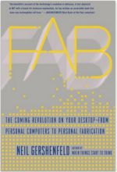

Fab Academy is an intensive [20 week course][Schedule] in digital fabrication.

It has its roots in MIT's course on [How to make (almost) anything][HTMAA], which
was started by [Prof. Neil Gershenfeld][ProfNeil] at MIT's [Center for Bits and
Atoms][CBA].

To know more about the idea and vision for digital fabrication, here's a great 
talk about "The Third Digital Revolution" given by Neil at SolidCon.

<iframe width="560" height="315" src="https://www.youtube.com/embed/L0RDrSKenGo" frameborder="0" allowfullscreen></iframe>

&nbsp;
   
Here is an [Edge.org interview][EdgeInterview], which goes into details about the background and motivation for personal fabrication.

And a book that he wrote - ["Fab: The Coming Revolution on Your Desktop"][FabBook].

This year more than 300 students are attending Fab Academy in [70 Fab Labs][FabLabs] all over the world, including 3 
locations in India (Trivandrum, Kochi & Pune).

The course covers [topics][Schedule] from CAD, computer-controlled
cutting, 3D printing, electronics & embedded systems, mechanical & machine
design, molding & casting, etc.

At the end of the course students have to build a project which brings together many, if not all, the 
skills they've learnt. 

Here is a list of the incredible [projects made by last year's students][2015Projects].

[FabAcademy]: http://fabacademy.org
[FabLabs]: http://archive.fabacademy.org/archives/2016/master/labs.html
[HTMAA]: http://fab.cba.mit.edu/classes/863.14/
[ProfNeil]: http://ng.cba.mit.edu/
[CBA]: http://cba.mit.edu/
[FabAcademy2016]: http://archive.fabacademy.org/archives/2016/master/
[Schedule]: http://archive.fabacademy.org/archives/2016/master/schedule.html
[2015Projects]: http://fabacademy.org/archives/2015/students/index.html
[SolidConTalk]: https://www.youtube.com/watch?v=L0RDrSKenGo
[EdgeInterview]: https://edge.org/conversation/neil_gershenfeld-digital-reality
[FabBook]: https://books.google.co.in/books?id=Zw0j50HDwYUC&lpg=PP1&pg=PP9#v=onepage&q&f=false
[FabLabTvm]: https://www.fablabs.io/fablabtrivandrum
