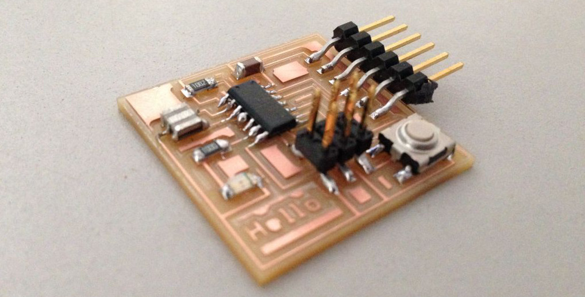

	

		<h1>Fab Academy 2016</h1>
		<h2 class="text-muted">Yogi Kulkarni</h2>
		&nbsp;
		

			This is my journey through <a href="http://archive.fabacademy.org/archives/2016/master/">Fab Academy 2016</a> 
			at <a href="https://www.fablabs.io/fablabtrivandrum">Fab Lab Trivandrum</a>, India.		
		

		

			Fab Academy is a 20-week course in digital fabrication. It has its roots in MIT’s course on 
		   <a href="http://fab.cba.mit.edu/classes/863.14/">How to make (almost) anything</a>, which was started by Prof. Neil 
		   Gershenfeld... <a href="fabacademy.html">read more</a>
		

	

	

			
	

	

		<h1>Final Project</h1>
		 	
	

	

		<h1>Weekly Assignments</h1>
	

	

		<a href="w1-principles.html"><h1>Principles & Practices</h1></a>
		<h2 class="text-muted">Final Project Sketch</h2>
		

			This week I sketched out a possible final project, called Hi! Time - a gesture sensing clock. 
		

	

	

		
	

	

		<a href="w2-cad.html"><h1>Computer-Aided Design</h1></a>
		

			This week we explored a variety of 2D, 3D, image and video processing tools. I designed a logo for 
			Hi! Time in Inkscape and created a 3D model of its back panel in Antimony. 
		

	

	

      
	

	

		<a href="w3-cutting.html"><h1>Computer-Controlled Cutting</h1></a>
		

			This week we worked on the laser-cutter and the vinyl-cutter. I created a press-fit geodesic hemisphere out 
			of cardboard and a craft-plywood box with flexured hinges.  
		

	

	

		
	

	

		<a href="w4-eprod.html"><h1>Electronics Production</h1></a>
		<h2 class="text-muted">FabISP</h2>
		

			This week we created an in-circuit programmer using an ATtiny45 microcontroller, milled it on the Modella and soldered all the components.
		

	

	

      
	

	

		<a href="w5-3d.html"><h1>3D Printing & Scanning</h1></a>
		

			The goal was to create something that would be difficult, if not impossible, to create with a subtractive process.
			I designed nested spheres in OpenSCAD and 3D printed it on the Ultimaker. I also 3D scanned some objects using an Xbox Kinect and Skanect.      
		

	

	

		
	

	

		<a href="w6-edesign.html"><h1>Electronics Design</h1></a>
		<h2 class="text-muted">Board with LED + Button</h2>
		

			This week I designed a board's schematic and layout in Eagle, milled it and soldered the components.   
		

	

	

      
	

	

		<a href="w7-machining.html"><h1>Computer-Controlled Machining </h1></a>
		

			This week we had to make something big on the Shopbot CNC router. I designed and made a table out of 18mm plywood.  
		

	

	

		
	

	

		<a href="w8-embedded.html"><h1>Embedded Programming</h1></a>
		

			This week I programmed the LED + Button board using Arduino, C, and AVR Assembly language. 
		

	

	

      
	

	

		<a href="w10-machine.html"><h1>Mechanical & Machine Design</h1></a>
		

			Over 2 weeks we built a 2-axis plotter in a group.   
		

	

	

		
	

	

		<a href="w12-input.html"><h1>Input Devices</h1></a>
		<h2 class="text-muted">Ambient Light Sensor</h2>
		

			I created a board with a phototransistor + LED to detect ambient and reflected light.  
		

	

	

      
	

	

		<a href="w13-molding.html"><h1>Molding & Casting</h1></a>
		<h2 class="text-muted">Spirograph Gear</h2>
		

			This week I created a wax mold from which I cast a silicone mold from which I cast a spirograph gear. 
		

	

	

      
	

	

		<a href="w14-output.html"><h1>Output Devices</h1></a>
		<h2 class="text-muted">7-Segment LED Board</h2>
		

		    This week I created a 7-segment LED board which can display digits. It uses a technique called Charlieplexing to 
		     minimize the number of pins needed to drive the LEDs.
		

	

	

      
	

	

		<a href="w15-composites.html"><h1>Composites</h1></a>
		

		    To be done.
		

	

	

      
	

	

		<a href="w16-networking.html"><h1>Networking & Communications</h1></a>
		<h2 class="text-muted">I2C Network</h2>
		

		This week I created a I2C network connecting 2 microcontrollers - 1 master and 1 slave.   
		

	

	

      
	

	

		<a href="w17-interface.html"><h1>Interface & Application Programming</h1></a>
		<h2 class="text-muted">Light Sensor Game Input</h2>
		

		I translated the ambient light sensor's readings into up & down movements to control an airplane in a 3D Javascript game
		    running in the browser. 
		

	

	

      
	

	

		<a href="w18-applications.html"><h1>Applications & Implications</h1></a>
		

		    This week was about planning the final project.  
		

	

	

      
	

	

		<a href="w19-invention.html"><h1>Invention, Intellectual Property and Income</h1></a>
		

		    To be done.
		

	

	

      
	

	

		<a href="w20-final.html"><h1>Final Project Development</h1></a>
		<h2 class="text-muted">Hi! Time - Gesture Sensing Clock</h2>
		

		

	

	

      
	

<!--
[FabAcademy]: http://fabacademy.org
[FabLabs]: http://archive.fabacademy.org/archives/2016/master/labs.html
[HTMAA]: http://fab.cba.mit.edu/classes/863.14/
[ProfNeil]: http://ng.cba.mit.edu/
[CBA]: http://cba.mit.edu/
[FabAcademy2016]: http://archive.fabacademy.org/archives/2016/master/
[Schedule]: http://archive.fabacademy.org/archives/2016/master/schedule.html
[2015Projects]: http://fabacademy.org/archives/2015/students/index.html
[SolidConTalk]: https://www.youtube.com/watch?v=L0RDrSKenGo
[EdgeInterview]: https://edge.org/conversation/neil_gershenfeld-digital-reality
[FabBook]: https://books.google.co.in/books?id=Zw0j50HDwYUC&lpg=PP1&pg=PP9#v=onepage&q&f=false

[ProfNeil]: http://ng.cba.mit.edu/
[CBA]: http://cba.mit.edu/
[FabAcademy2016]: http://archive.fabacademy.org/archives/2016/master/
[Schedule]: http://archive.fabacademy.org/archives/2016/master/schedule.html
[2015Projects]: http://fabacademy.org/archives/2015/students/index.html
[SolidConTalk]: https://www.youtube.com/watch?v=L0RDrSKenGo
[EdgeInterview]: https://edge.org/conversation/neil_gershenfeld-digital-reality
[FabBook]: https://books.google.co.in/books?id=Zw0j50HDwYUC&lpg=PP1&pg=PP9#v=onepage&q&f=false
[FabLabTvm]: https://www.fablabs.io/fablabtrivandrum
-->