[Class Notes](http://academy.cba.mit.edu/classes/molding_casting/index.html)   
[Lecture Video](https://vimeo.com/163576093)

## Assignment

> design a 3D mold, machine it, and cast parts from it

I've decided to do a simple object first in order to get familiar with the workflow, which is completely new to me. These are the steps:
 
* create 3D model, ideally in a tool which supports boolean operations, like Antimony or OpenSCAD.
* export an STL file, convert to PNG, generate toolpath using fabmodules
* mill it using the Modella out of machineable wax 
    * rough cut
    * finishing cut
* create a silicone mold
* cast a piece using DryStone

---

I'm making a [spirograph](http://www.thingiverse.com/thing:905849), which can be used to create interesting designs.

I used Rhino to create a 3D model:

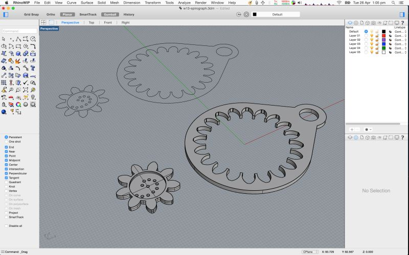

---

Next, I designed the silicone mold for it by subtracting the above design from a cuboid.  

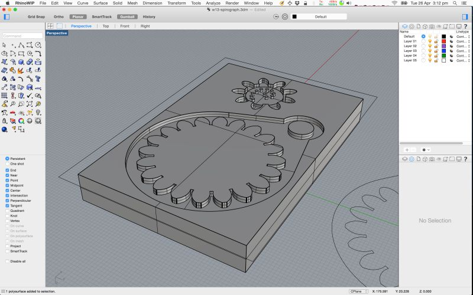

---

Then I designed the wax mold for the silicone mold, by subtracting the above from a bigger cuboid. This 
    positive -> negative -> positive thinking definitely takes some time to get used to!

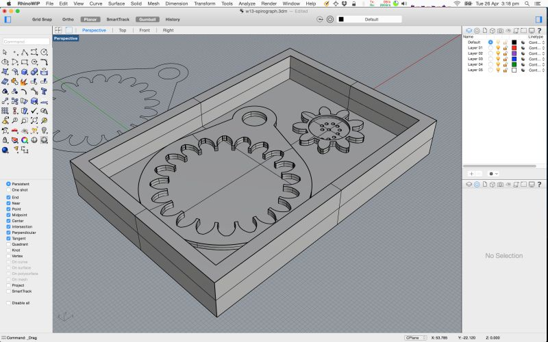

---

I wanted to do a test run, so I created a mold only for the gear:

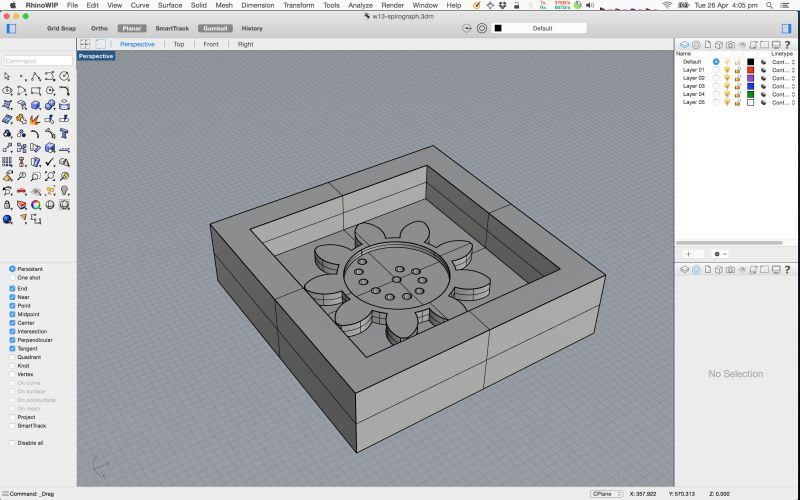

---

Original Files:

*  Rhino 3DM file and STL file: [spirograph.zip](files/spirograph.zip))

---
These are the settings in fabmodules for the rough-cut with a 1/8th inch flat-nose end-mill:

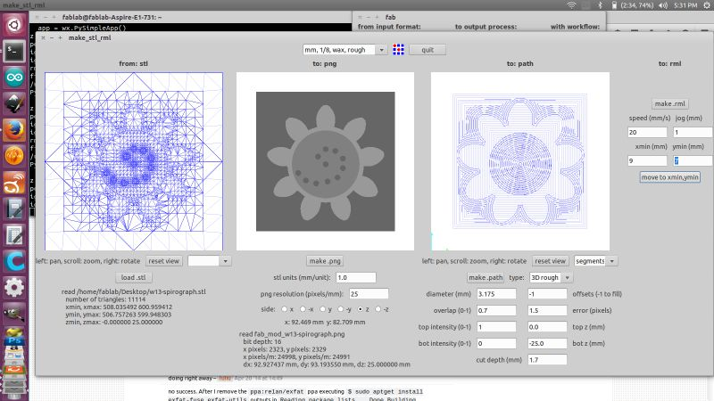

---

These are the settings for the finishing-cut with a 1/16th inch end-mill:

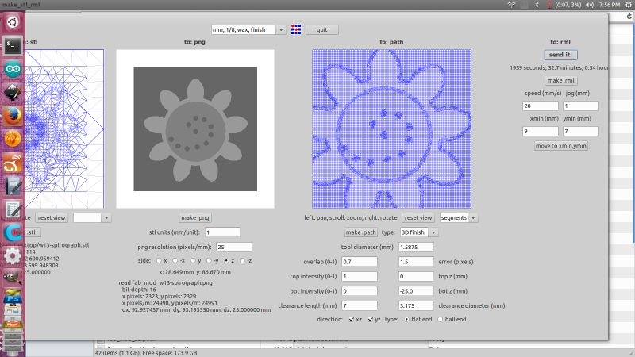

---

Here is the mold after the rough cut, notice that the holes weren't cut:

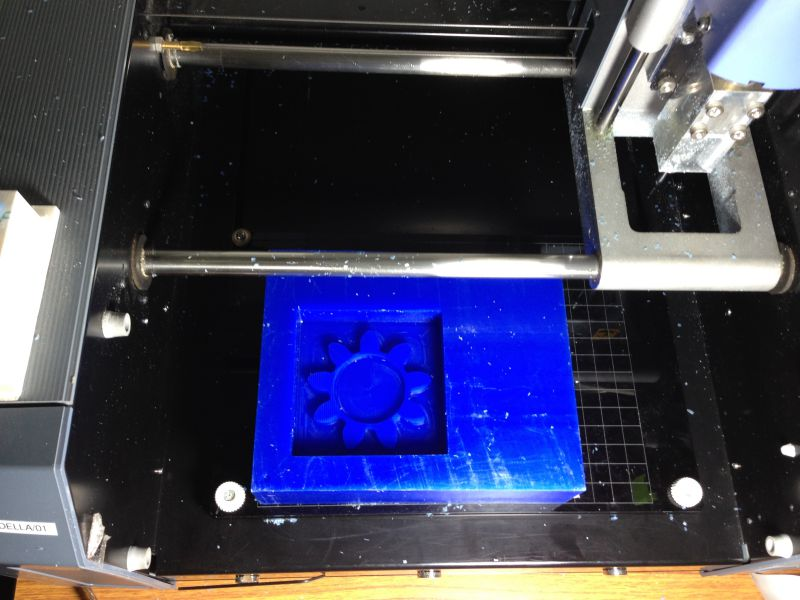

---

Here is the mold after the finishing cut with the holes cut out too:

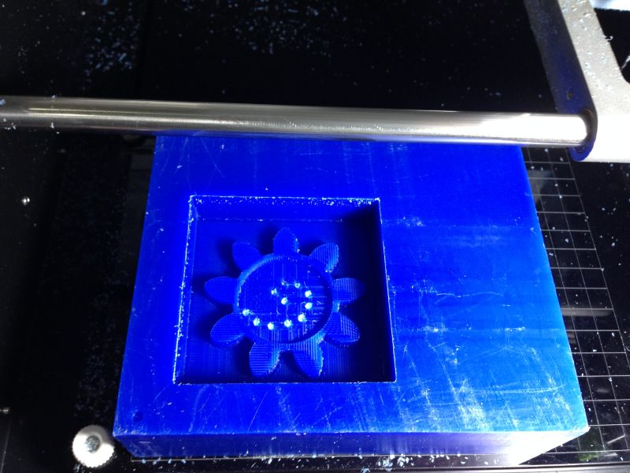

---

Next step was to cast the silicone mold. 

* I used [Sorta-Clear 37 Silicone Rubber](https://www.smooth-on.com/product-line/sorta-clear/), which is made by mixing 2 parts (Part A & B) in 1:1 ratio.
* First I measured the volume required by pouting water into the wax mold and emptying the water into a cup.
* Next I took equal volumes of Part B and Part A in separate glasses and mixed these individually.
* Then I added a little red dye to Part B, just to try some colour.
* Then I mixed part A into Part B and mixed it for 3-4 minutes 
* I then poured a little of the mixture into the mold and pressed it into the holes.
* I then poured the rest and shook the mold to let it settle.
* I used about 100g of silicone mixture (part A + B). 

Part A & B ready to be mixed:

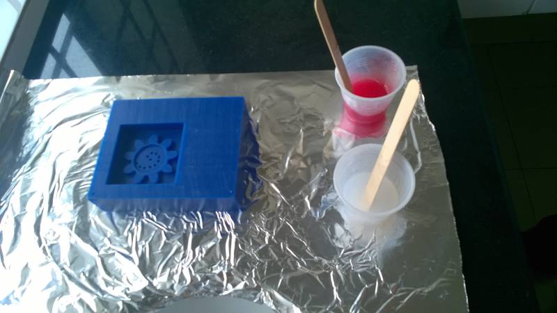

Mixing in progress: 

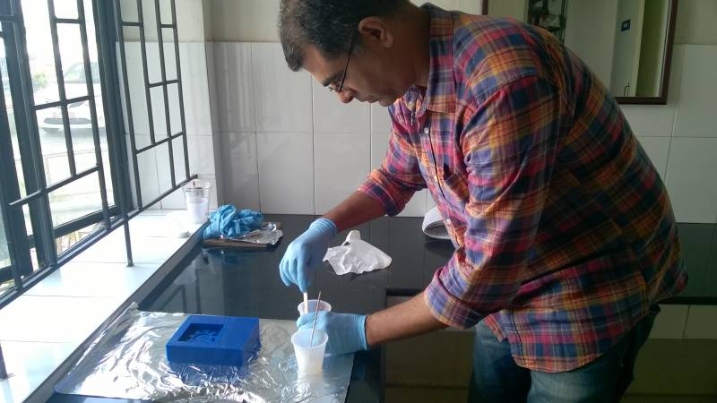

Filled mold ready for curing:

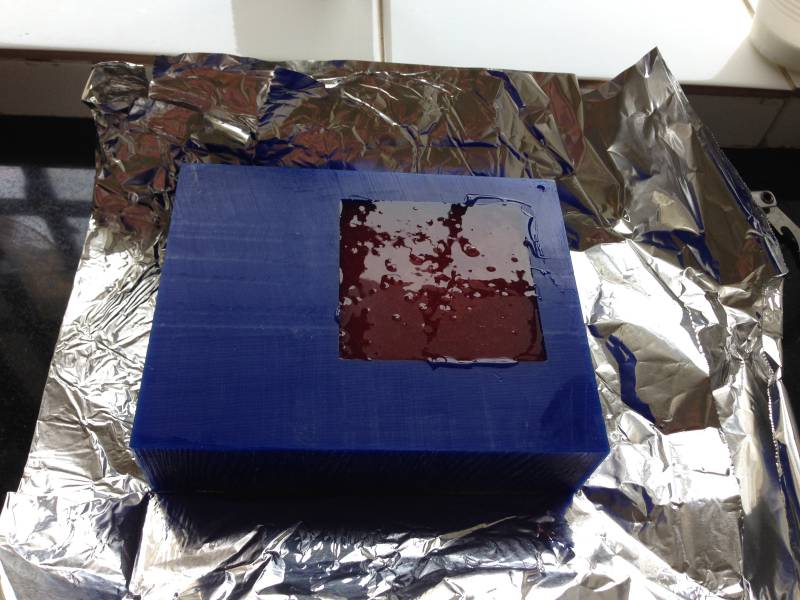

The curing process takes 4 hours. Here is the mold right after it was removed:

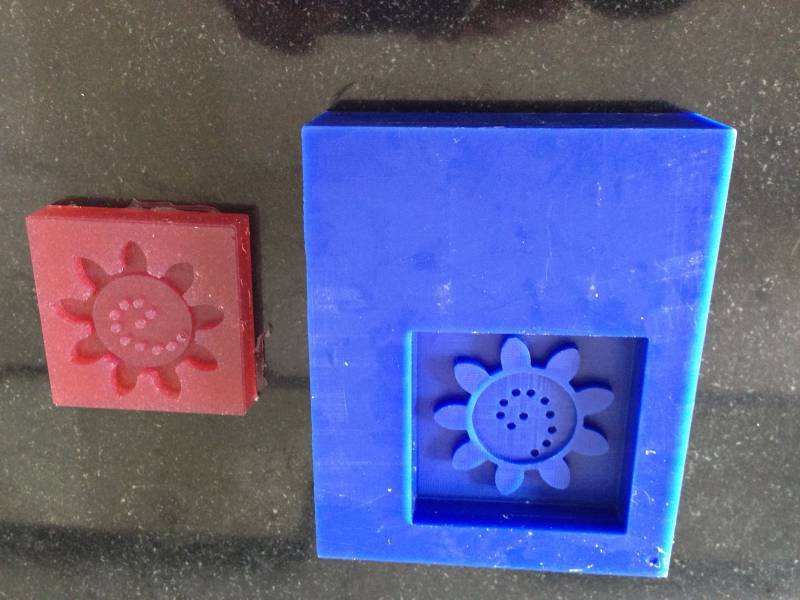

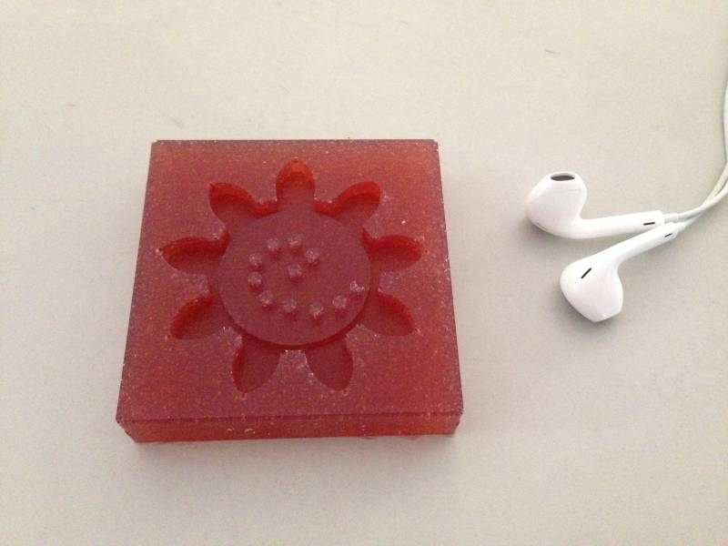

---

Next, I cast the actual piece using [Smooth Cast 305 Resin](https://www.smooth-on.com/product-line/smooth-cast/), which sets in 30 min.
 
Here is the filled up mold:

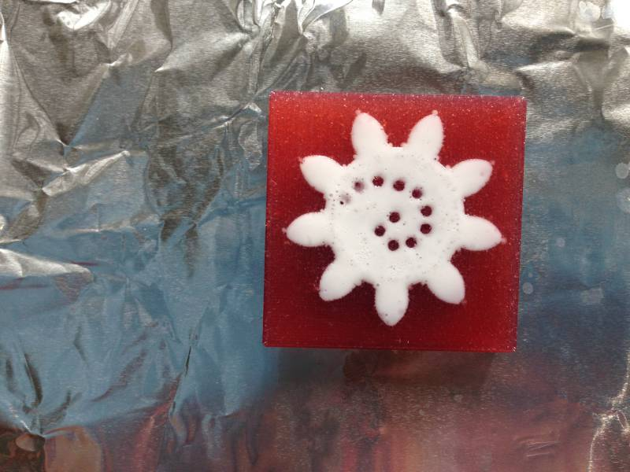

And this is right after removal:

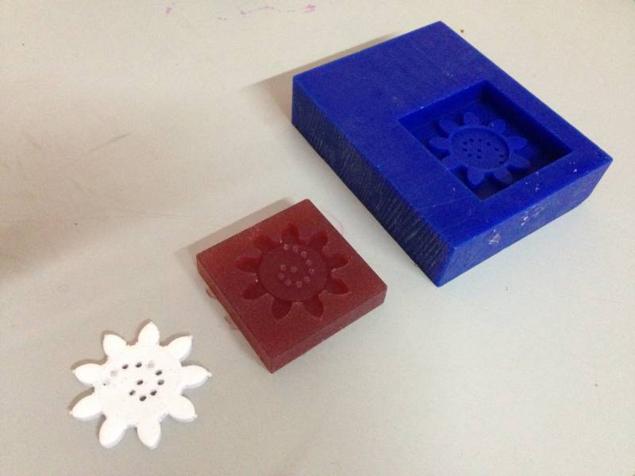

The top surface is not as flat as I expected it to be, probably because I filled it a little too much. It also has many tiny air bubbles.

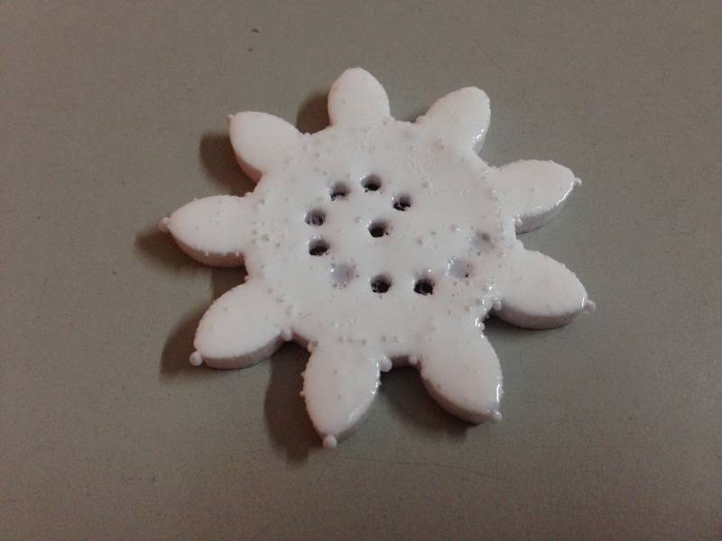

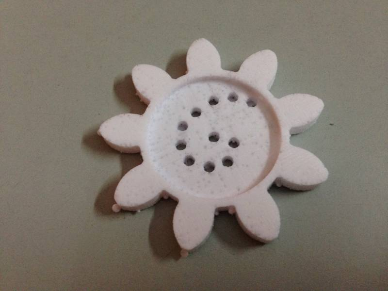
