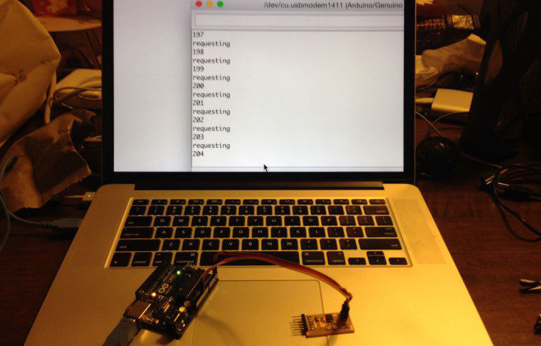

[Class Notes](http://academy.cba.mit.edu/classes/networking_communications/index.html)   

## Assignment

>  design and build a wired &/or wireless network connecting at least two processors

Due to lack of time I have been working on my [final project](w20-final.html), which will include a I2C network of 
    modules controlled by a master. 

I will be updating this page with the networking related sections once I'm able to make progress on the final project. 

## 23rd May

I researched TWI / I2C slave libraries which were implemented in software and did not require the TWI hardware available in some of
    the higher end AVRs. 
    
I found [TinyWire](https://github.com/rambo/TinyWire), which is a CPP library that calls into the USI-TWI library written by Donald Blake. 

The other option is to tweak Neil's i2c_master code to work for slaves. 

First, I'm going to try TinyWire. 

I found some sample code [here](https://thewanderingengineer.com/2014/02/17/attiny-i2c-slave/) to test out the I2C interaction. However, 
    when I hooked up the Arduino module and the slave board, the slave MCU got extremely hot and I had to disconnect it. 
     
As a next step I'm trying some simpler code to send data from the master to slave only: 

This is the master:

<pre>
<code class="language-clike">
//Code for the Arduino Uno
#include &lt;Wire.h&gt;
 
void setup()
{
  Wire.begin(); // join i2c bus (address optional for master)
}
 
byte x = 0;

void loop() {
  Wire.beginTransmission(0x4);
  Wire.write(++x % 2);        
  Wire.endTransmission();    

  delay(1000);
}
</code></pre>

This is the slave:

<pre>
<code class="language-clike">

#define output(directions, pin) (directions |= (1 << pin)) // set port direction for output
#define input(directions, pin) (directions &= (~(1 << pin))) // set port direction for input
#define set(port, pin) (port |= (1 << pin)) // set port pin
#define clear(port, pin) (port &= (~(1 << pin))) // clear port pin

#define LED_PIN PB3

#define I2C_SLAVE_ADDRESS 0x4 // Address of the slave
 
#include &lt;TinyWireS.h&gt;
 
void setup()
{
    output(DDRB, LED_PIN);
    clear(PORTB, LED_PIN);
    
    TinyWireS.begin(I2C_SLAVE_ADDRESS); // join i2c network
}
 
void loop()
{
  byte recd = 1;
  if(TinyWireS.available()) {
      recd = TinyWireS.receive();
      if(recd == 1) {
          clear(PORTB, LED_PIN);
      } else {
          set(PORTB, LED_PIN);
      }
  }
}

</code>
</pre>

This worked fine, the slave blinked the LED every 1 sec.

Next step is to get the slave to send back some data to the master. 

Here is the master code I tried:

<pre>
<code class="language-clike">
#include &lt;Wire.h&gt;

void setup() {
  Wire.begin(); // join i2c bus (address optional for master)
  Serial.begin(9600); // start serial for output
}

void loop() {
  Serial.println("requesting");
  Wire.requestFrom(4, 1); // request 1 byte from slave device address 4

  while (Wire.available()) // slave may send less than requested
  {
    int i = Wire.read(); // receive a byte as character
    Serial.println(i); // print the character
  }

  delay(50);
}
</code></pre>

Here is the slave code:

<pre>
<code class="language-clike">
// Code for the ATtiny85
#define I2C_SLAVE_ADDRESS 0x4 // Address of the slave

#include &lt;TinyWireS.h&gt;

int i=0;

void setup()
{
    TinyWireS.begin(I2C_SLAVE_ADDRESS); // join i2c network
    //TinyWireS.onReceive(receiveEvent); // not using this
    TinyWireS.onRequest(requestEvent);
    
    // Turn on LED when program starts
    pinMode(1, OUTPUT);
    digitalWrite(1, HIGH);
}

void loop()
{
    // This needs to be here
    TinyWireS_stop_check();
}

// Gets called when the ATtiny receives an i2c request
void requestEvent()
{
    TinyWireS.send(i);
    i++;
}
</code></pre>

I uploaded the slave code with the internal clock set to 8mhz. This worked perfectly well! The master was outputting incrementing
    numbers from the slave. 
    

I tried reproducing the scenario where the slave board was heating up, but couldn't - it seemed to work fine with all the changes I tried 
    1) changing internal clock to 1mhz 2) using VCC & GND from the Arduino 
    
Anyhow its great to have a working I2C slave implementation.
 
### Original Files

* [master.ino](files/w16/master/master.ino)
* [slave.ino](files/w16/slave/slave.ino)
