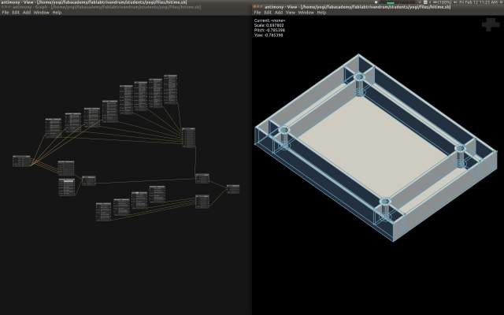
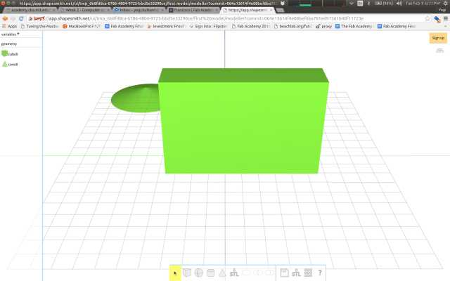

## [Assignment][CAD]

> Model (draw, render, animate, simulate, ...) a possible final project, and post it on your class page

&nbsp;

### Summary of tool evaluations

Here are my key takeaways from all the tool evaluations. 

I really liked the control and simplicity of a hardware description language, so that would possibly be my first 
choice for complex projects. 

For simpler projects and to tinker interactively I'd use OnShape. 

Surprisingly I found some things that should have been simple in OnShape to be actually quite hard, like
adding a lip to an injection molded part. It was not immediately apparent how to go about achieving the effect - 
should 2 extrusions of different depths be used, or a side-profile, or a main extrusion with a shell cut-away. I ended up spending
 quite a long time trying to figure this out, and still don't have a clear answer.
  
On the other hand, the directness of hardware description languages and Constructive Solid Geometry is refreshing! 
 Even though it takes a little longer to get started with a diagram, you can make sure and steady progress.

Here are my overall tool choices:

* Gimp for photo-editing
* Inkscape for vector graphics, logos, icons, etc.
* OnShape for interactive 3D modeling 
* Antimony, OpenSCAD for procedural modeling

Here is a partly done 3D model for the back cover of the HiTime clock (my final project) done in Antimony.  
 
 

Notes for each tool explored and original files are in the sections below. 

&nbsp;

---

&nbsp;

### 2D Concepts
 
Before exploring the tools, I wanted to quickly understand what's possible with image editing. 

A few hours of research helped refresh the basics:

* [Raster graphics](https://en.wikipedia.org/wiki/Raster_graphics): bit-mapped, dot-matrix pixel structure
* [Color Model](https://en.wikipedia.org/wiki/Color_model): RGB (additive) used in digital displays, CMYK (subtractive) used for printing
* [Colour depth](https://en.wikipedia.org/wiki/Color_depth): number of bits per pixel, which can be from 2 - 48 bits. 24 bits is true colour, supporting ~16 million colours.
* [Colour channel](https://en.wikipedia.org/wiki/Channel_(digital_image)): components of an image, e.g Red, Blue and Green channel in RGB
* [Alpha channel](https://en.wikipedia.org/wiki/Alpha_compositing): used to indicate transparency 
* File formats
    * [GIF](https://en.wikipedia.org/wiki/GIF): 
        * 8 bit palette from 16m colours
        * LZW lossless compression
        * Good for sharp-edged lines with limited colours e.g. logos, icons; but not for photos
        * Support for sub-images, which can be changed with time delays like frames to produce animation
        * Supports interlacing (progressive rendering from low-res to higer-res as image download proceeds)
    * [PNG](https://en.wikipedia.org/wiki/Portable_Network_Graphics)
        * Was developed to avoid the patent-issues in GIF's use of LZW
        * Supports palette based 24-bit (RGB) or 32-bit (RGBA) images, grayscale images and full-colour non-palette based images  
        * Lossless compression using DEFLATE algorithm
        * Good for logos / icons, not for photos  
    * [JPEG](https://en.wikipedia.org/wiki/JPEG)
        * lossy compression
        * great for photos, can compress 10:1 with little perceptible quality loss
        * supports interlaced progressive display
* [Image editing](https://en.wikipedia.org/wiki/Image_editing)
    * Selection: select parts of the image to alter 
    * Layers: treat the image as a stack of transparencies, allows for non-destructive editing
    * Image scaling: resize while retaining aspect-ratio
    * Cropping: extract a rectangular sub-part of the image
    * [Histogram](https://en.wikipedia.org/wiki/Curve_(tonality)): chart out number of pixels by their brightness and allow changes to the brightness
    * Compositing: merging images
    * Filters: transform images
* [Vector Graphics](https://en.wikipedia.org/wiki/Vector_graphics): 
    * Consists of objects that can be expressed as mathematical curves and paths
    * Images can be scaled infinitely without losing sharpness
    * Simple primitives like lines, bezier curves, rectangles, ellipses
    * Supports vector operations like rotate, mirror, stretch, merge, etc.
    * Also supports set operations like union, intersection, difference, etc.
    * SVG ([Scalable Vector Graphics](https://en.wikipedia.org/wiki/Scalable_Vector_Graphics)) is the standard vector image format supported by most web-browsers
    

&nbsp;

---

&nbsp;

#### [GraphicsMagick](http://www.graphicsmagick.org/)

Is a command-line power-tool that can be used to convert, scale, transform, combine images.
 
It supports similar commands and arguments as ImageMagick, e.g. 
 
`gm convert freecad.png -scale 640x480 -quality 50 images/freecad.jpg`

&nbsp;

---

&nbsp;

#### [Gimp](http://gimp.org)

I read through some [excellent](http://gimp-tutorials.net/Parrot_Photo_Manipulation_in_Gimp/) 
[tutorials](http://puteraaladin.blogspot.de/2008/11/cool-typhography-design-in-gimp.html) [on](http://www.gimp.org/tutorials/)
 Gimp, which gave me some idea of what's possible.

I then created this composite image:
 

 
It was made out of the following images:
 
 (A photo from my recent vacation)

 (From [here](http://wallpaperiphone.xyz/best-darth-vader-wallpapers-hd-download-5497/))   
 
The tough part was selecting and extracting the foreground image of vader from the scene. 

Gimp offers a few selection tools for this including: path select, intelligent edge select, foreground select, 
select by color, fuzzy select, etc. I tried them all but finally used the intelligent edge select which gives the most 
control (could have also used the path select). Here's the outline of Vader being selected.

The extracted image was pasted into the beach photo. This created a new layer, which I then merged to create a single layer
 and scaled to 640 height while retaining aspect ratio. Finally the image was exported to jpg at 30% quality. 

Impression: Good graphics editor with a rich feature set. Usability is a bit quirky at times, but you get used to it. 

Original files: [Gimp xcf file](files/beach-vader.xcf)

&nbsp;

---

&nbsp;

#### [Adobe Photoshop](http://www.adobe.com/in/products/photoshop.html)

Skipping for now because I'd need to install wine to get it running on Ubuntu.

&nbsp;

---

&nbsp;

#### [MyPaint](http://mypaint.org)

Is for free-hand drawing with a tablet. Installing on Linux was easy using apt-get. 

Here's a Rorschach image I drew using the touchpad and its symmetry tool: 

Impression: Good for free-hand drawing using a tablet. 

&nbsp;

---

&nbsp;

#### [Krita](https://krita.org)

Another drawing tool that's great for concept art and comics, but requires a tablet to use effectively.
  
Installing it was just a matter of `apt-get install krita`. 

I didn't spend too much time with it, but it does look pretty full featured and some of the [tutorials](https://www.youtube.com/watch?v=YigbVY9s6gU) 
for creating comics show its functionality to be quite rich.
 
&nbsp;

---

&nbsp;

 
#### [Inkscape](https://inkscape.org)

Is a vector graphics editor. I installed it using apt.

I created this SVG logo for Hi! Time (my potential final project of a gesture recognizing digital clock) using a hand 
image from [here](http://pix.iemoji.com/images/emoji/apple/ios-9/256/white-waving-hand-sign.png)
and drawing out the rest using simple primitives like lines, rectangles and bezier curves.

 

Here is a screenshot of the image being edited in inkscape.

 

Impression: I liked Inkscape. It has good primitives for manipulating vector objects and its usability is better than Gimp. 

Original files: [logo svg](images/hi-time-logo.svg). 

&nbsp;

---

&nbsp;

### 3D Concepts

* [3D modeling](https://en.wikipedia.org/wiki/3D_modeling): process of creating a mathematical representation of a physical body as a 3D surface.
* Representation could be either as a:
    * Solid: based on the volume of the object. More realistic. Used in CAD, [Constructive Solid Geometry](https://en.wikipedia.org/wiki/Constructive_solid_geometry), 
        which involves boolean operations like union, intersection, difference.
    * Shell / boundary / surface: based on the surface of the object. Commonly used in games and films.
* [3D rendering](https://en.wikipedia.org/wiki/3D_rendering): conversion of a 3D model into a 2D image. Methods: wire-frames, ray tracing, etc.
* Modeling process: 
    * [Polygonal mesh](https://en.wikipedia.org/wiki/Polygonal_modeling): points / vertices representing the surface of a body connected into non-overlapping polygons (often triangles).
    * Curves: using weighted control points to guide a curve e.g. [NURBS](https://en.wikipedia.org/wiki/Non-uniform_rational_B-spline) 
       

&nbsp;

---

&nbsp;

   
#### [SketchUp](http://www.sketchup.com)

Requires Windows, skipping for now. 

&nbsp;

---

&nbsp;

#### [TinkerCad](http://tinkercad.com)

Online tool, easy to create simple shapes, but a bit too simplistic. It doesn't seem to have basic snapping, constraining 
features, at least I couldn't figure out how to snap & align objects easily. Didn't spend too much time on this. 

 

&nbsp;

---

&nbsp;

#### [Shapesmith](http://shapesmith.net)

Online parametric tool. Did not seem to have too many features and I was struggling to align objects and merge them easily.
 
  

&nbsp;

---

&nbsp;

#### [Flood](https://www.floodeditor.com/app.html#)

Online visual, parametric tool. Poor usability. There's virtually no help documentation, and its not clear how to combine 
nodes to creat the shape thats needed.

 

&nbsp;

---

&nbsp;

#### [Rhino](http://rhino3d.com)

It requires Windows. I tried installing it using Wine, but it failed to startup correctly. Skipping for now.

&nbsp;

---

&nbsp;

#### [OnShape](https://www.onshape.com)

This is the most promising tool so far. 
 
It runs completely in the browser and has excellent collaboration and versioning features. 

You can create unlimited "Public" documents, and upto 10 "Private" documents.
 
The documentation is excellent. 

They have thought deeply about usability. The UI is intuitive and there are keyboard shortcuts for the most commonly used commands. 

I followed a tutorial to create this part, it took about 10 min. 

 

I also created a simple back cover for my clock project. I will be using this as a hello world to try out tools. 

  

Original files: [tutorial STL](files/onshape-tutorial.stl), [clock back cover STL](files/onshape-hitime.stl)

&nbsp;

---

&nbsp;

#### [Blender](https://www.blender.org/)

Installed this through apt. It looks really complex, and I'll probably need to read through some tutorials to get a hang of it.

 

&nbsp;

---

&nbsp;

#### [FreeCAD](http://www.freecadweb.org/)

Installed it through apt. Seems to have some of the features expected of a good CAD, like assemblies, parts, constraints, sketches, etc.

However, I didn't particularly like the UI and usability, but the documentation seems to be good - so it might just be a matter of spending more time with it.

 

&nbsp;

---

&nbsp;

#### [Fusion 360](http://www.autodesk.com/products/fusion-360/overview)

Skipping it because it requires Windows / Mac. From the documentation it seems very similar to OnShape in terms of good usability, 
collaboration workflows, parameteric-support, etc.

&nbsp;

---

&nbsp;

#### [AC3D](http://www.inivis.com/)

Linux tgz is available from the website. The app did not start up immediately, it complained of a missing library libXmu. 
It worked fine once I ran `apt-get install libxmu6:i386`.
 
The interesting thing about the tool is that it shows 4 simultaneous views from different perspectives when editing a sketch. 
This is very useful, and I wonder why other tools don't support it.

I didn't explore the tool much further.

 

&nbsp;

---

&nbsp;

#### [OpenSCAD](http://www.openscad.org/documentation.html)

Installed via apt. It is a procedural 3D compiler based on a custom textual description language. It has a CSG engine built in.
 
I really liked the simplicity and control offered by a programmable tool. 

 

Original file: [scad file](files/test.scad)

&nbsp;

---

&nbsp;

#### [Kokopelli](https://github.com/mkeeter/kokopelli/)

Installed it using the instructions on the [wiki](https://github.com/mkeeter/kokopelli/wiki/Installing). 
It uses Python as its hardware description language. Similar to OpenSCAD, but you have the full power of Python vs a stripped down 
 language like in OpenSCAD. Very nice!

 

Original files: [test.ko](files/test.ko).

&nbsp;

---

&nbsp;

#### [Antimony](https://github.com/mkeeter/antimony)

Installed it using the [instructions](https://github.com/mkeeter/antimony/blob/develop/BUILDING.md) on the wiki. 

It seems a lot like kokopelli. I'm still not sure if I like the visual graph and nodes UI. It requires too many clicks and I 
 prefer the full view of the script to edit as can be done in kokpelli. 

Here I've modeled the back cover of the HiTime clock, with bosses and ribs.

One of my concerns with Antimony was that as compared to Kokopelli, I couldn't write a single script in Python for the whole diagram
and instead would need to click and edit multiple scripts (for each node). However, I realized that the Script node allows me 
to do just that, thanks to this [great example](http://fab.cba.mit.edu/classes/863.15/section.Harvard/people/Bozorgmir/project-3.html) 
from another student.

I'm still struggling with placing things correctly, for example the bosses in the image below were duplicated and placed individually.
I tried the Array 3D node, but the math to get the placement right was taking too long. In this I missed OnShapes constraints feature.
 
Overall Antimony looks very promising to me.

 

Original files: [hitime.sb](files/hitime.sb).

[CAD]: http://academy.cba.mit.edu/classes/computer_design/index.html

