## [Assignment](http://academy.cba.mit.edu/classes/computer_cutting/index.html)

> Design, make, and document a parametric press-fit construction

&nbsp;

### Laser Cutter 

I explored a lot of projects to see what might be interesting to make with the Laser Cutter.

Here are some great creations:

* Living hinges with flexures:
    * [Living hinge](https://en.wikipedia.org/wiki/Living_hinge)
    * [Folding Booklet](https://www.snijlab.nl/en/p/288/folding-wood-booklet)
    * [Plywood living hinge technique](http://makezine.com/2011/10/25/plywood-living-hinge-technique-for-laser-cutters/)
    * [Epilog examples](https://www.epiloglaser.com/resources/sample-club.htm)
    * [Kerf bending patterns](http://www.gedankensuppe.de/kerf-bending-patterns)
    * [Flexure lamp](http://fabacademy.org/archives/2015/sa/students/asprilla.daniel/wk03.html)
    * [Kerflight](http://graypants.bigcartel.com/product/kerflight-selwyn-pendant)
    * [Cork lampshade with flexure-like technique](http://vicara.org/filter/lighting/Corkmatters-Lugh)
* Geodesic [lampshade](http://infosyncratic.nl/weblog/2008/09/16/press-fit-geodesic-dome/)
* MDF [polyhedron](http://fabacademy.org/archives/2015/eu/students/vloet.frank/week03.html)
* Paper [light](http://fabacademy.org/archives/2015/sa/students/amaut.arely/My_work.html)
* Puzzle [lamp](https://www.epiloglaser.com/resources/sample-club/iqlamp.html)
* Laser-cut bowling [set](https://www.epiloglaser.com/resources/sample-club/bowling-set.htm)
* [Bulbing-light](http://www.bulbing-light.com/products/bulbing-lamp): 3D image on a 2D acrylic surface!
    Similar [FabLab project](http://fabacademy.org/archives/2015/sa/students/giron.huber/week3-computer-controlled-cutting.html).
* [Kirigami](http://paper-life.ru/en/kirigami-scheme/289-stairway-to-heaven)

#### Geodesic Lantern

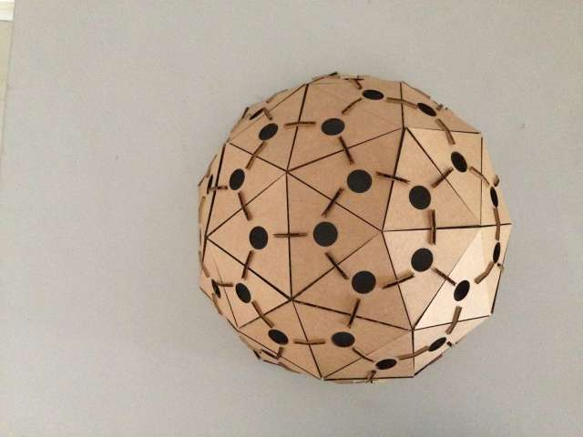

I decided to to build a Geodesic structure with holes so that it could be used as a lantern.

An [online](http://www.desertdomes.com/domecalc.html) [geodesic](http://geo-dome.co.uk/article.asp?uname=calculation)
calculator can be used to figure out the dimesions of the triangles that make up the structure based on
 a given radius.

I chose to create a 2V geodesic, which is made up of 2 types of triangles. You can also make a 3V, 4V, 5V one.

I started modeling it in Inkscape, but got frsutrated trying to draw a rectangle with correct dimensions and angles. I
tried Antimony, AutoCAD and finally settled on Rhino 3D (Mac version). Here is a screenshot of the design.

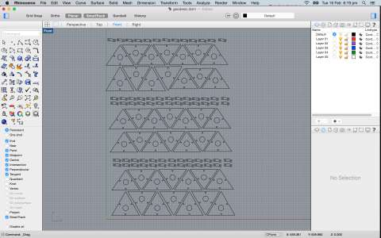

Once the design was done, I was able to send a print to our Trotec Speedy 100 Laser Printer.

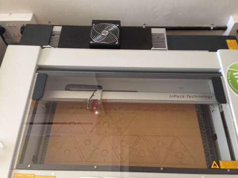

After this it was time to start putting it together.

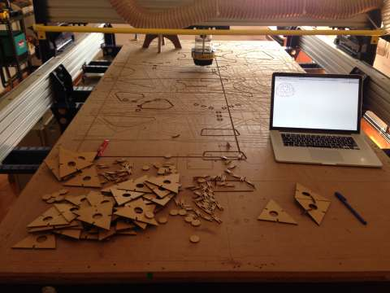

The top pentagon done.

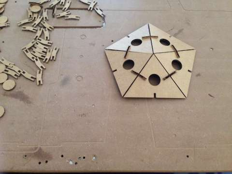

And here is the finished structure. It turns out that I printed out enough triangles for only half a dome &#128514;!

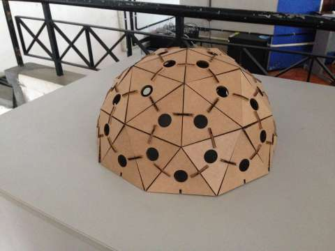

Admiring my creation :-)

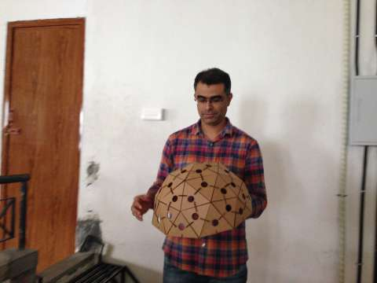

**Learnings**

* Inkscape is NOT a CAD tool and don't try to use it as one, especially when you need exact dimensions.

* Drawing triangles in Antimony is painful because you need to specify coordinates rather than the side lenghts.

* Rhino is not parametric, but Grasshopper is (there is a [WIP build](http://www.grasshopper3d.com/page/grasshopper-for-mac)
    available for the Mac).

* It is very important to test a few different notch widths before printing all the pieces, to ensure a correct and tight fit
    for the press-fit kit.

**Original Files**

* [Rhino project](files/geodesic.3dm.zip)

&nbsp;

---

&nbsp;

### Box with flexure hinges

Inspired by [this](https://www.snijlab.nl/en/p/288/folding-wood-booklet) I decided to make a craft plywood box with
hinges.

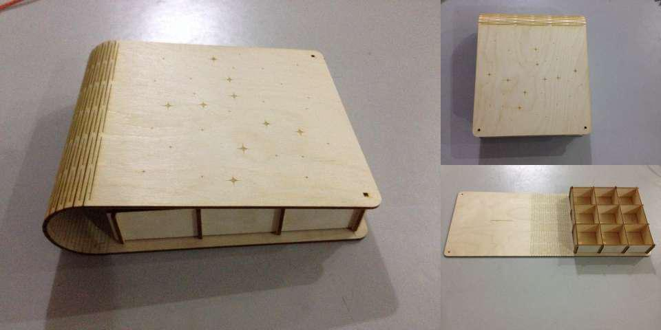

Here is a screenshot of the Rhino drawing:

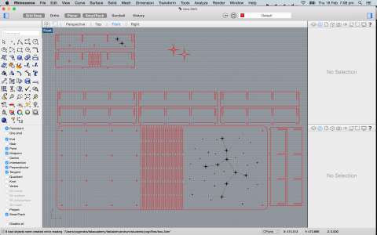

Here is the comp I created to figure out the notch sizes and test the flexure:

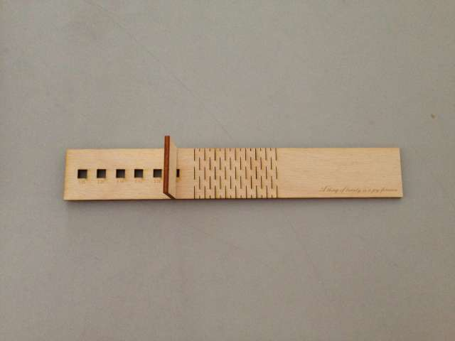

This project had several learnings:

* In the first attempt the laser caused burn marks on the underside of the plywood. This was because the laser was making
multiple passes on some lines which were duplicates that got created during copying and pasting lines.

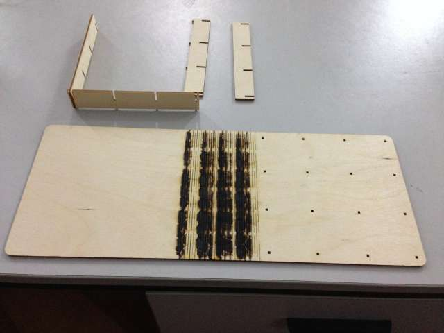

* Rhino scaled down the image when I was copying over the files from a Mac to a Windows machine to print. This resulted in
 the notches being too small for the joints. I tried Layouts and Details in Rhino but it refused to scale correctly even when
 layout units : model units was set as 1:1. I finally exported the model to a Autocad dxf format and then used CorelDraw
 to load it and convert it to SVG. During this conversion the stars on the cover were not converted properly. So I exported
 from CorelDraw to svg and used Inkscape to fix the drawing and print. Inkscape retained the scale as specified.

* Flexures need to be quite close to each other, I used a gap of 3mm between 2 flexure lines and this worked well.
  Previously I had tried with 5 mm and that didn't work - the hinge was too stiff.

* Don't forget to add chamfers to nothces, otherwise it's really hard to slide in parts when you're trying for a tight fit.

**Original Files**

* [Rhino project](files/box.3dm.zip)
* [Exported AutoCAD file](files/box.dxf.zip)

&nbsp;

---

&nbsp;

### Vinyl Cutter

I created a Death Star decal for my Mac.

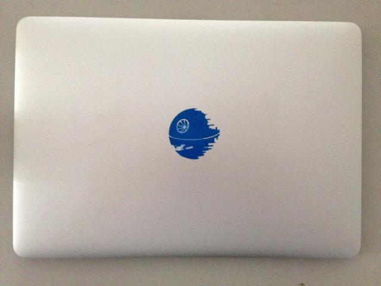

Steps:

* Install fabmodules usign the instructions [here](http://kokompe.cba.mit.edu/downloads.html).
* Setup the printer for the Roland Vinyl Cutter using instructions [here](http://vkbg.github.io/week2.html).
* Scale your png to 500 dpi, without this the paths are quite lossy. The left image below was at 100 dpi, the right one at 500 dpi.
    You can see the detailing in the right image is much better.

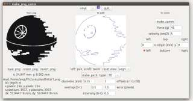
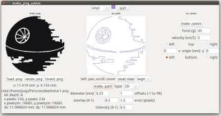
