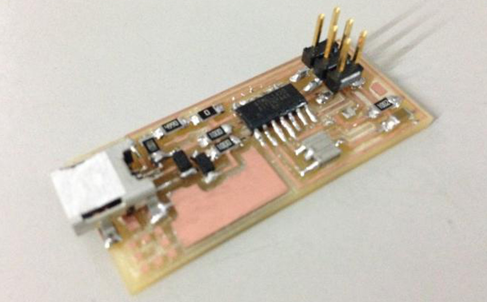

## [Assignment](http://academy.cba.mit.edu/classes/electronics_production/index.html)

> Make an in-circuit programmer

&nbsp;

The goal is to mill this board and stuff it with all the components:
 

### Milling the Board

I followed this [excellent tutorial](https://www.youtube.com/watch?v=jkLJI8L7TUs&feature=youtu.be) by Adam Harris to get familiar with PCB milling.

My first attempt did not work out well. 

I used the 1/32nd end-mill for cutting the traces instead of the 1/64th one and the traces were either too narrow or 
completely missing in some cases. 

Also, the board wasn't stuck tightly enough to the sacrifical layer and was moving around a little during cutting. 

Here is the board:

Here are the different end-mills from 1/64th, 1/32nd, 1/16th and 1/8th, so that I don't make this mistake again!

Here's the 2nd attempt. This time I used the correct end-mill and used double-sided tape to stick the board tightly to the substrate.
This time the traces were much wider. 

Here it is after cleaning it with soap (to get fingerprints off):

&nbsp;

---

&nbsp;

### Stuffing the Board

Here's the inital inventory:

I watched this [Collin's Lab tutorial](http://makezine.com/2016/02/19/learn-simple-surface-mount-soldering-in-collins-lab/) 
on surface mount soldering, which helped a lot. But it did take a while to get a hang of the soldering process and figure 
out the correct way to get the solder to flow.  

This is after the first 2 components were soldered. 

I'm using double-sided tape to hold down the board. 

Here is the board strapped up: 

While soldering I noticed that one of the traces (the right most one coming out of the Mini USB pads) had got cut during milling. 
I bridged this trace with some solder. 

I then followed [this tutorial](http://archive.fabacademy.org/archives/2016/doc/programming_FabISP.html) to program the ISP.

Here it is hooked up to another FabISP to be programmed: 

Here is the final ISP:

