## [Assignment](http://academy.cba.mit.edu/classes/scanning_printing/index.html)

> - Test the limits for your 3D-printer (group project)
> - Design and 3D print an object (small, few cm) that cannot be made subtractively
> - 3D scan an object (and optionally print it) (extra credit: make your own scanner)

&nbsp;

### 3D Printing Possibilities and Limitations
  
I was curious to know more about what kind of things can be made with 3D printing, it's strengths and weaknesses... here are my notes:
 
* [Stratasys 3D Printing Curriculum Guide](http://www.stratasys.com/industries/education/educators/curriculum/introduction-to-3d-printing) is 
 an excellent course on 3D printing. Many references below are from there.
*  (It has...) "the ability to produce a fully functional “machine” in one print. It is the only manufacturing process that can interlock
  parts within parts to produce functioning closed systems that require no assembly." 
* [3D-printing technologies](https://www.additively.com/en/learn-about/3d-printing-technologies)
  * Stereolithography: scanning a UV laser through a vat of liquid photopolymer. A platform is lowered as the surface 
    solidifies and the piece is built layer-by-layer. High resolution, poor mechanical properties, expensive materials, slow.
  * Fused Deposition Melting: extrude plastics through a head layer-by-layer. 
  * Laser Melting: metal powder is melted layer-by-layer. Durable, low resolution, rougher surface finish.
  * Electron Beam: thin layer of metal powder melted by an electron beam. Similar properties to Laser Melting.
  * Binder Jetting: ink-jet head applies binding agent to powders. Full colour possible, poor mechanical properties.
  * Material Jetting: ink-jet head drops molten wax onto a surface. Works only with wax, high resolution, good finish, can be used to create molds.
  * Polyjet: ink-jet head drops photoplymers onto a surface and is immediately UV cured. Multiple colours, good finish, poor mechanical properties. 
* Important aspects
  * Slicing: the model is sliced into horizontal layers for which a tool path can be generated.
  * Support: For overhangs additional support structues might be printed, which can be removed after printing.
  * Fill: Density of material fill affects weight and structural properties.   
* Future trends for printing: buildings, food, etc.

&nbsp;

---

&nbsp;

### Test 3D-Printer Limits

We have an Ultimaker 2 in our FabLab.

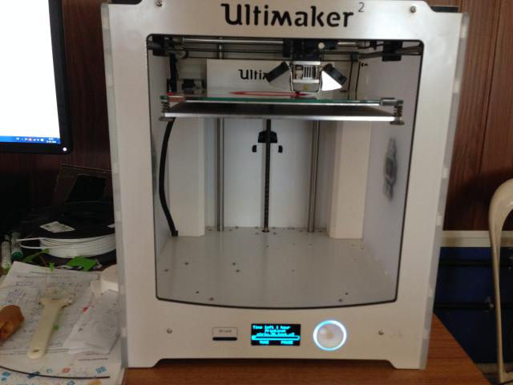

In order to test it we looked for test projects on [Thingiverse](http://www.thingiverse.com/search?q=test&sa=) and
shortlisted this [one](http://www.thingiverse.com/thing:1363023), which seems complex enough.

Here is the STL file opened in Cura, which is the software that Ultimaker provides to convert from STL to G-code.

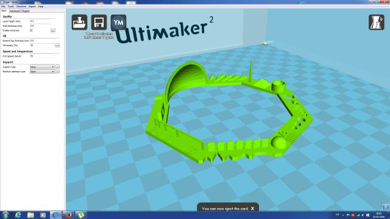

The print took about 1 hr to complete. Here is the finished product:

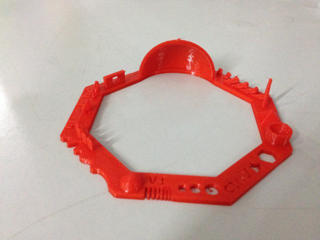

At this point I realized I had chosen "Support Type" option as "Everywhere", which is not ideal for a test.

So I took another printout with "Support Type" set to "None". Here are all the settings:

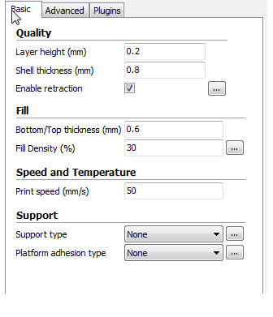
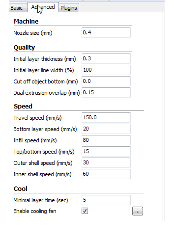

Here is the 2nd print:

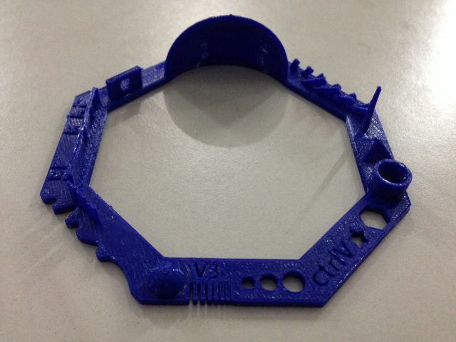

Here is how Ultimaker performed on all the tests:

Here's the test spec:
 
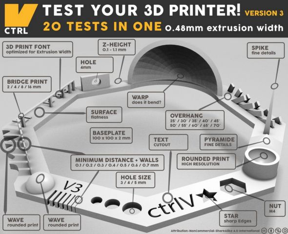 

* Nut, Size M4 Nut should fit perfectly:  
 _Matches M4 width of 6.78 mm and corner width of 7.6 mm_
 
* Wave, rounded print:  
 _Looks fine_
 
* Star, Sharp Edges:  
 _Yes_
 
* Name, Complex Shapes:  
 _Look fine_
 
* Holes, Size 3, 4, 5 mm:  
 _Dimensions match_
 
* Minimal Distance: 0.1, 0.2, 0.3, 0.4, 0.5, 0.6, 0.7 mm:  
 _0.5 mm was the minimum gap that was clearly visible, smaller than that wasn't - this is probably because we were using the 0.4 mm nozzle size._

* Wall Thickness: 0.1, 0.2, 0.3, 0.4, 0.5, 0.6, 0.7 mm  
 _Printed only 3 walls. This too would be because of the nozzle size._

* Bridge Print: 2, 4, 8, 16 mm:  
 _Dimensions match_
 

* Sphere, Rounded Print 4.8mm height:  
 _Was around 4mm._
 
* Overhang: 25, 30, 35, 40, 45, 50, 55, 60, 65, 70°:  
 _It was able to print all_

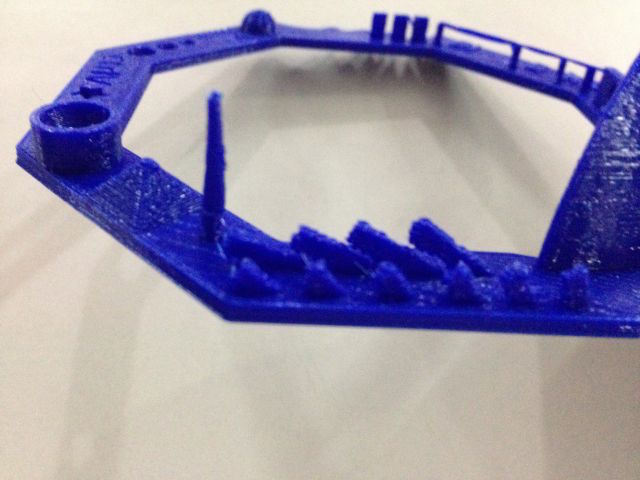

* Warp, does it bend?:  
 _No_
 
 
* 3D Print Font, optimized for 3D printing:   
 _Looks fine_
 
* Surface, Flatness:   
 _Looks fine_
 
* Size, 100 x 100mm x 23.83 (10mm width):   
 _Surprisingly it was 94 mm x 94 mm._
 
* Spike, minimum Layer Time, 21 mm height from Bottom (include Baseplate):   
 _Height was 18 mm_
 
* Hole in Wall, 4 mm diameter, check for proper print:   
 _Matches dimension_
 

&nbsp;

---

&nbsp;

### 3D Printing

The idea is to print multiple small objects which cannot be created subtractively. This involves nested objects  

Some of the interesting projects that caught my attention:

* [Gear systems](http://www.thingiverse.com/thing:185912)
* [Twisted lanterns / vase](http://www.thingiverse.com/thing:1054598/#files), [wave lamp](http://www.thingiverse.com/thing:774456)
* [Spiral tower](http://www.thingiverse.com/thing:783098/#files)
* [Interlocking cable chain](http://www.thingiverse.com/thing:8724/#files)
* [Paradoxical / Illusion designs](http://www.thingiverse.com/thing:547580/#files) 
* [Spirograph](http://www.thingiverse.com/thing:905849)
* [Gyroscope](http://www.thingiverse.com/thing:1307100), [GyroAir](http://www.thingiverse.com/thing:653085/#files)
* [Parametric pen-holder](http://www.thingiverse.com/thing:73489/#files)
* [Rubber-band launched gliders](http://www.thingiverse.com/thing:1115840/#files)
* [Voronoi lamp](http://www.thingiverse.com/thing:584714/#files)
* [Knot pen holder](http://www.thingiverse.com/thing:195396)

From these I want to make:

* Twisting structure, a vase or lantern
* Nested structure, gyroscope
* Spirograph (though this could be made subtractively, I really liked the use of gears to produce complex patterns)
  
For the above I want to use a parametric tool, possibly OpenSCAD.

&nbsp;

#### Nested structure

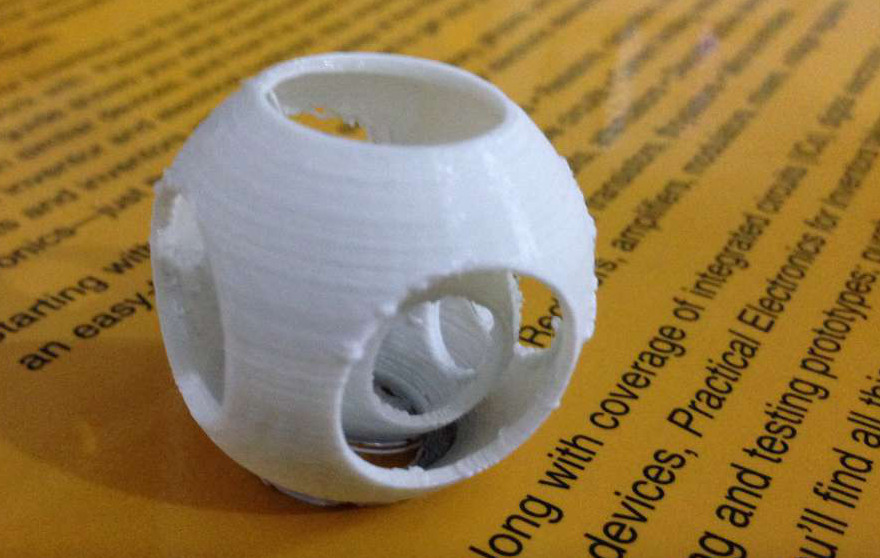

Inspired by [this](http://www.3dgeni.us/getting-started-with-openscad/) I decided to make a nested structure in OpenScad. 

Here is the code and rendering in OpenScad:

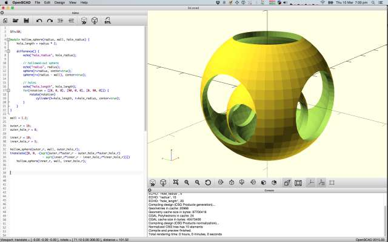

The code itself was surprisingly compact. The code has been parameterized for outer and inner sphere radius and hole sizes. 

The tricky part was moving the inner sphere down in line with the outer sphere
    so that it could be printed without supports.
    
<pre>

$fn=50;

module hollow_sphere(radius, wall, hole_radius) {
    hole_length = radius * 2;
  
    difference() {
        echo("hole_radius", hole_radius);
        
        // hollowed-out sphere
        echo("radius", radius);
        sphere(r=radius, center=true);
        sphere(r=(radius - wall), center=true);
        
        // holes
        echo("hole_length", hole_length);
        for(rotation = [[0, 0, 0], [90, 0, 0], [0, 90, 0]]) {
            rotate(rotation)
                cylinder(h=hole_length, r=hole_radius, center=true);
        }
    }
}

wall = 1.2;

outer_r = 16;
outer_hole_r = 8;

inner_r = 10;
inner_hole_r = 5;

hollow_sphere(outer_r, wall, outer_hole_r);
translate([0, 0, -(sqrt(outer_r*outer_r - outer_hole_r*outer_hole_r) 
                    - sqrt(inner_r*inner_r - inner_hole_r*inner_hole_r))])
    hollow_sphere(inner_r, wall, inner_hole_r);

</pre>

After this I used Cura to generate the gcode. I used the following settings:

* nozzle size: 0.4mm
* shell thickness: 1.2mm
* support: none
* platform adhesion type: brim 

Here is an animation of Cura's Layer View (I just needed an excuse to add an animated gif :-)):

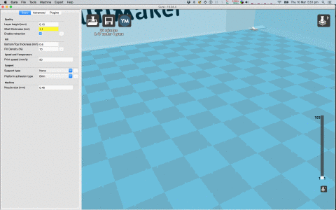

I then exported the gcode and gave the print command to Ultimaker. Here is the print in progress:

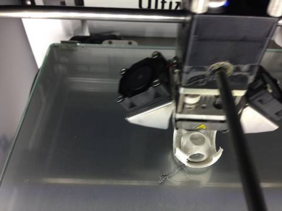

Here is the sphere right after printing. Notice the brim, which took a bit of scraping to remove:

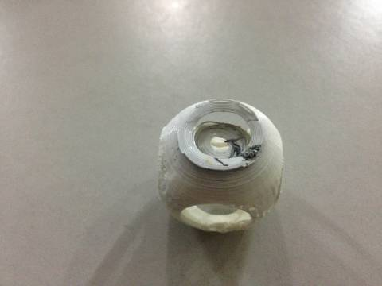

Here is the cleaned up one:

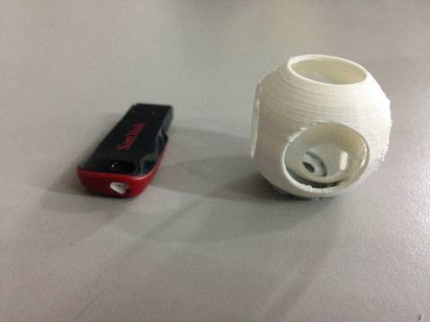
   
&nbsp;
     
#### Original Files

* OpenScad source: [3d.scad](files/3d.scad)
* STL file: [3d.stl.zip](files/3d.stl.zip)
 

&nbsp;

---

&nbsp;
 
### 3D Scanning

#### Skanect

I used XBox Kinect with Skanect to scan a the Geodesic I'd made recently. 
 
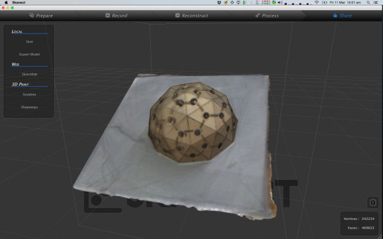

Here is the STL dislplayed in an [online viewer](http://www.viewstl.com/): 

 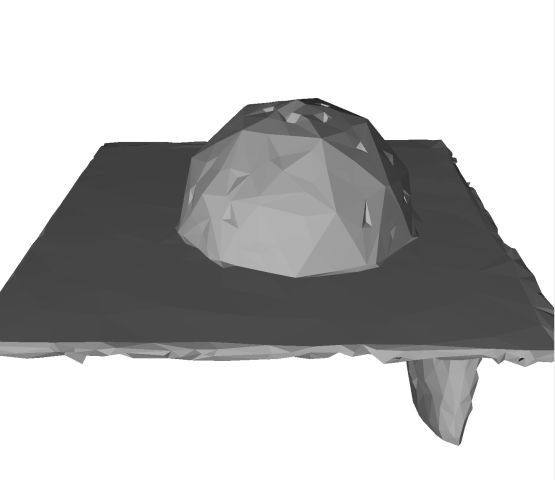

I also scanned a chair:

 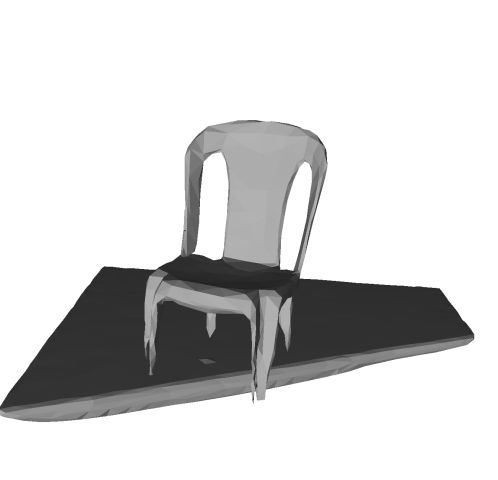

It took a while to figure out the right distance to stand at and speed to move around the object.
   
Also there needs to be sufficient contrast between the object and its background, especially the floor. 

#### Photogrammetry

I also tried 123D Catch, but the scan didn't turn out too well:
 
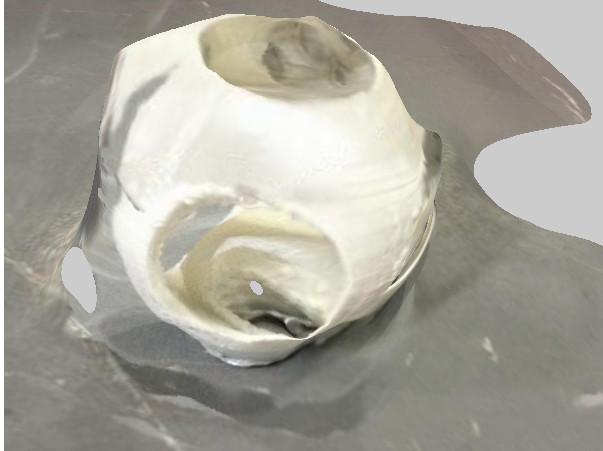
 
#### Original Files

* [Geodesic Scan STL](files/geodesic-scan.stl.zip)
* [Chair Scan STL](files/chair-scan.stl.zip)
