## [Assignment](http://academy.cba.mit.edu/classes/electronics_design/index.html)

> redraw the echo hello-world board   
> - add (at least) a button and LED (with current-limiting resistor)   
> - check the design rules, and make it   
> - extra credit: simulate its operation   

&nbsp;

### Index

- [Schematics](#schematics)
- [Layout](#layout)
- [Milling](#milling)
- [Original files](#original-files)
- [Notes](#notes)

&nbsp;

---

&nbsp;

### Schematics

The assignment is to redraw the [following board](http://academy.cba.mit.edu/classes/embedded_programming/index.html#echo) and add a button and LED to it:

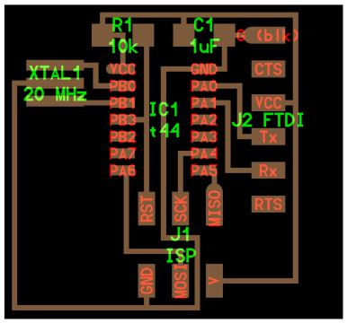

First step - go through some Eagle tutorials:

* Youtube videos by Jeremy Burns: [part 1](https://www.youtube.com/watch?v=1AXwjZoyNno), [part 2](https://www.youtube.com/watch?v=CCTs0mNXY24).
* [MIT Electronics Design 101](http://fab.cba.mit.edu/classes/863.15/doc/tutorials/electronics_design/ElectronicsDesign101.html): 
 also get the [PPT](http://fab.cba.mit.edu/classes/863.15/doc/tutorials/electronics_design/Electronics_101_v2.pptx).
* [Fab Academy tutorial](http://archive.fabacademy.org/archives/2016/doc/electronics_design_eagle.html).
* SparkFun [schematic](https://learn.sparkfun.com/tutorials/using-eagle-schematic) and [board](https://learn.sparkfun.com/tutorials/using-eagle-board-layout) tutorials.

Install Eagle, then download [fab.lbr](files/fab.lbr) (library of components) and place it into the lbr folder in your Eagle installation.
 
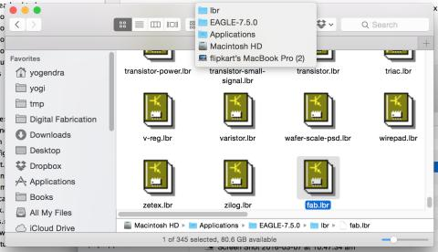

Switch to Eagle and click the menu-item for "Library -> Use", and select all the files and click open.

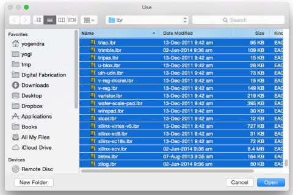

Similarly, download [fab.dru](files/fab.dru) (design rules) and place it in the dru folder in the Eagle installation.

Create a new project in Eagle and add a schematic to it. 

Add components from the library (look for components directly under the Fab folder in the Add Dialog):

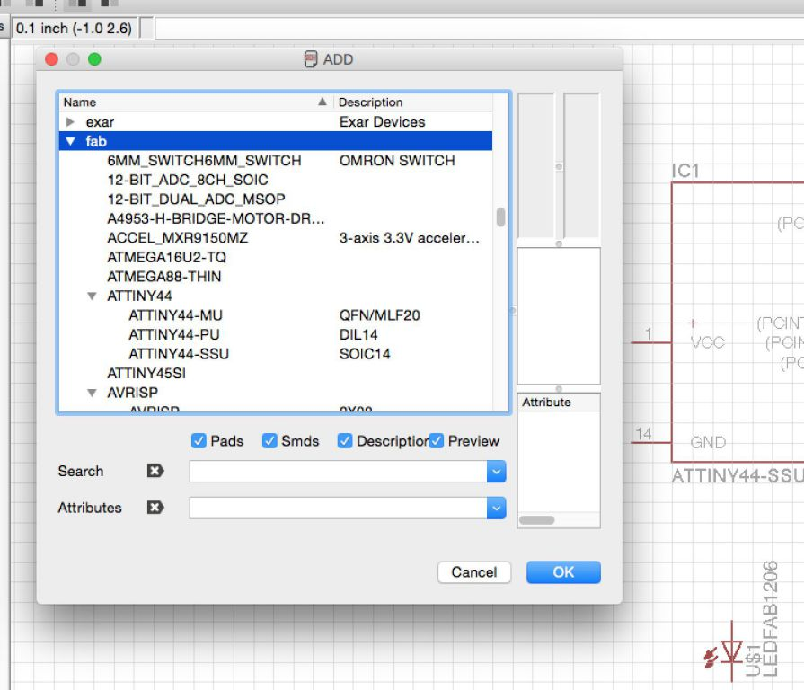

* ATtiny44-SSU: [datasheet](http://www.atmel.com/images/doc8006.pdf)
* 20mhz resonator: ATtiny has an inbuilt 8mhz clock, but this one is faster and more accurate 
* 6mm Switch Omrom
* AVR ISP SMD header: for programming the board 
* FTDI SMD header: powers the board and allows it to speak to the computer
* 10K resistor x 2
* 1µF capacitor
* GND: Ground
* VCC: Power supply 

Pro tip: Assign keyboard shortcuts to switch quickly between commands by clicking the menu item "Options => Assign".

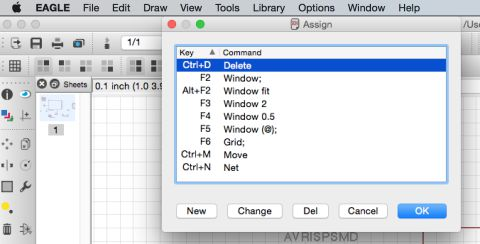

To figure out the resistor required for the LED, check the [LED datasheet](http://www.digikey.com/product-detail/en/LTST-C150GKT/160-1169-1-ND/269241).
It mentions a Voltage - Forward (Vf) of 2.1V and DC Forward Current of 30mA (Ifc). To calculate the required resistance:

<pre>
 R = (Vs - Vf) / Ifc
=> R = (5V - 2.1V) / 0.03A     
=> R = 96.67 Ohms
</pre>

Given a requirement of 96.67 Ohms, I will use a 100 Ohms resistor. The power dissipation in the resistor would be:
 
<pre>
 P = VI  
=> P = 2.9V x 0.03A  
=> 87mW
</pre>

To check if the 100 Ohm resistor would support this, find its part number from the 
[FabLab Inventory](https://docs.google.com/spreadsheets/d/1U-jcBWOJEjBT5A0N84IUubtcHKMEMtndQPLCkZCkVsU/pub?single=true&gid=0&output=html)
and look it up at the vendor's site. 

In this case, the [100 Ohm resistor](http://www.digikey.com/product-detail/en/RC1206FR-07100RL/311-100FRCT-ND/731438) 
has a power rating of 0.25W, which is well above 0.087W that it is expected to dissipate.

Here is the final schematic. 

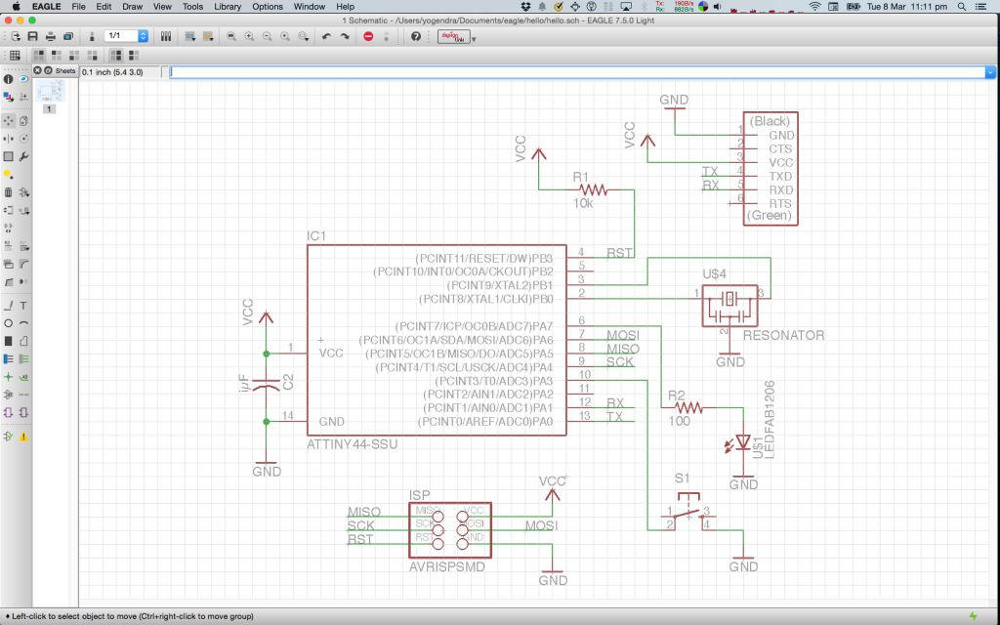

It took a surprisingly long time to create this, especially figuring out how to connect the components.
Creating keyboard shortcuts for the commands helped a lot.

&nbsp;

---

&nbsp;

### Layout

With the schematic done, switch to board view. 
 
First I attempted Autorouting. Here is the output with Top = Auto and Bottom = NA, since I wanted a single side board only.

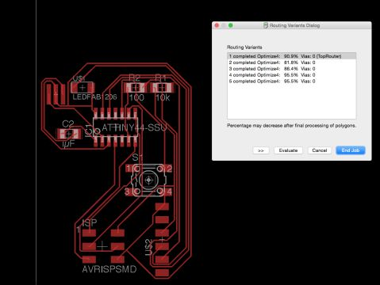

After this I manually routed the traces using the tutorial as a guide. 

Then I ran the fab Design Rule Checks, which revealed a few traces were too close to each other and the font width was too small. 

I changed the trace width from 0.016 in to 0.012 in and increased the font width, and that fixed the errors. 

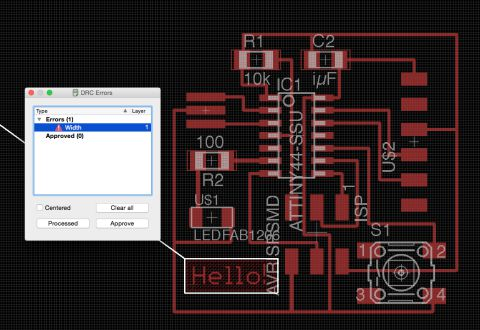

Here is the final layout: 
    
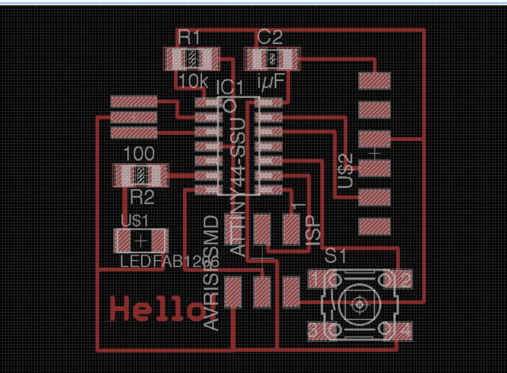

&nbsp;

---

&nbsp;

### Milling

Export the layout as a monochrome png at 500 dpi. Here is the output:

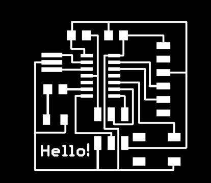

Then edit it in Gimp to crop and set a white border - change Canvas size, add 20 px to height and width, center it then Image -> Flatten, 
 this will add a 20px white border. 

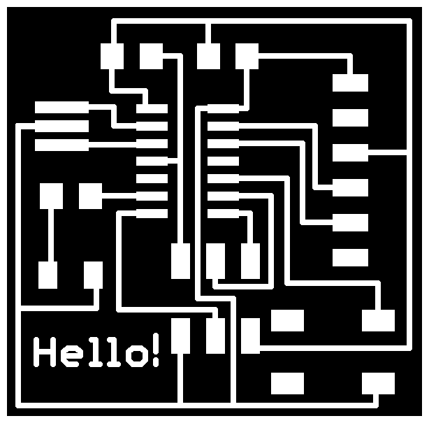

Then create the outline image for milling by bucket filling all the internal areas with white in Gimp, and adding a 20 px black border.

 

The traces for the board turned out to be too narrow and were peeling off in some places, as shown in the image below. 
 
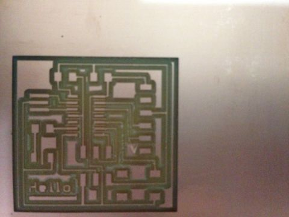 
 
I increased the trace widths from 0.012 in to 0.015 in and milled again. This was the result:

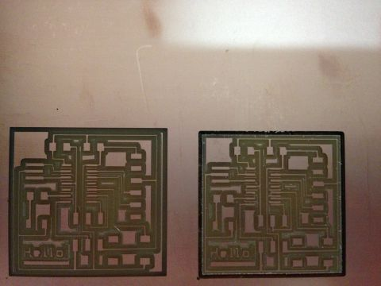 

In the 2nd board some of the traces were quite narrow, but I went ahead and cut it out, here is the final milled board:

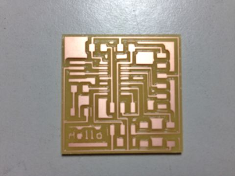
  
I tested the traces for current flow using a multimeter and it confirmed that these were working fine:
 
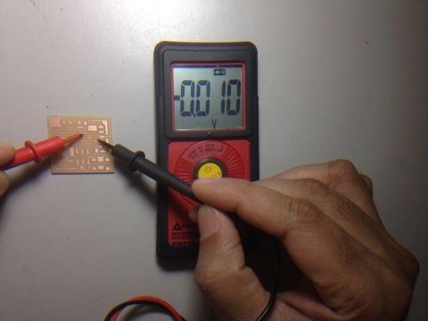

Last step was to stuff the board. Here is the completed board:
  
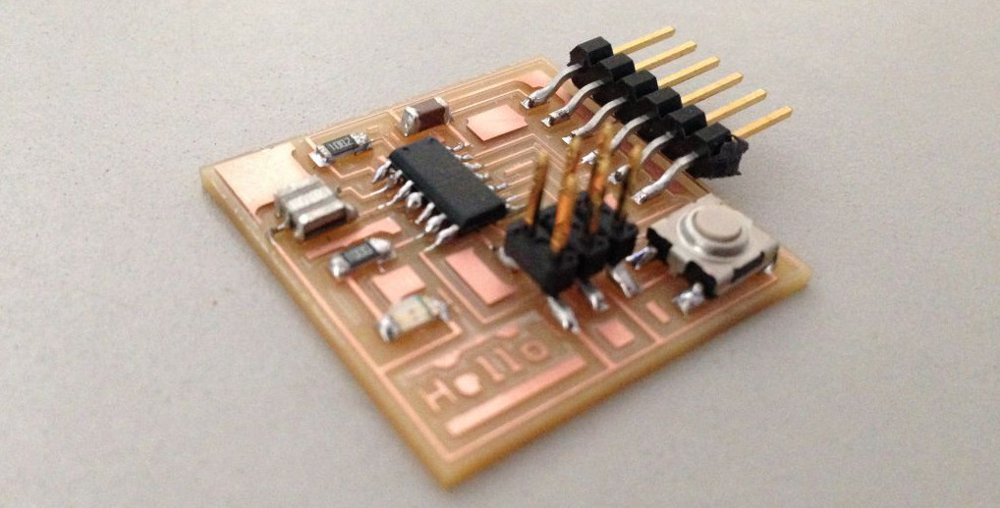

&nbsp;

---

&nbsp;

### Original Files

* Schematic: [hello.sch](files/hello.sch)
* Board layout: [hello.brd](files/hello.brd)
* Milling traces image: [hello-traces.png](files/hello-traces.png)
* Milling outline image: [hello-outline.png](files/hello-outline.png)

&nbsp;

---

&nbsp;

### Notes

__ATtiny44-SSU microcontroller__

* [Datasheet](http://www.atmel.com/images/doc8006.pdf)  
* 8-bit microcontroller
* Modified Harvard architecture   
   * Harvard architecture uses separate address space for data and instructions unlike Von Neumann architectures. This allows
     concurrent and faster access to instructions and data even without caches.   
   * Modified Harvard architecture has separate instruction and data caches backed by a shared memory.   
* In-system programmable, EEPROM (Electrically Eraseable Programmable ROM)
* RAM
* Special Function Registors (part of RAM)
