## [Assignment](http://academy.cba.mit.edu/classes/computer_machining/index.html)

> make something big!!   

&nbsp;

## Inspiration

Here are some great designs I came across:
 
* [Atfab](http://atfab.co/cnc-furniture/)
* [Opendesk](https://www.opendesk.cc/designs)
* [Italic shelf](http://www.ronen-kadushin.com/index.php/open-design/italic-shelf/)
* [Curved shelves](http://www.pedroterralab.com/open-source-furniture/)
* [Match table](http://supershape.org/Produktside_8.html)
* [Minimal waste table](http://design-milk.com/plus-table-by-fraaiheid/?utm_source=feedburner&utm_campaign=Feed:+design-milk+(Design+Milk))

## Design

I decided to build something similar to the Match table. 

Once I started designing in Rhino, I realized I needed to invest time understanding how to think in terms of Rhino's primitives. So
1 day was spent going through Rhino tutorials.

Here is the design in artistic mode:

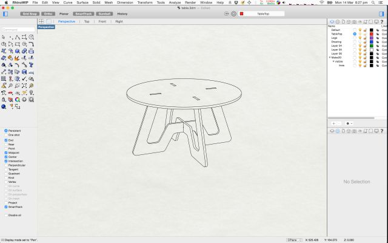

Here are the wireframes:

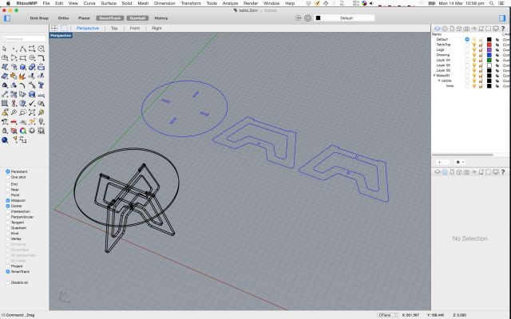

## Scaled down model

Next step is to laser cut a scaled down model using craft plywood (3mm). 

The original design was done with wood thickness assumed to be 6mm. So I needed to use Rhino's Scale function to scale 
it proportionately down by 50%.

Here is the table right after it was laser cut: 

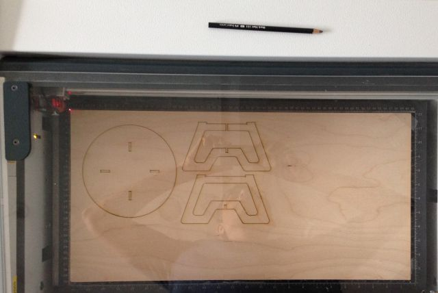

Here is the assembled table:

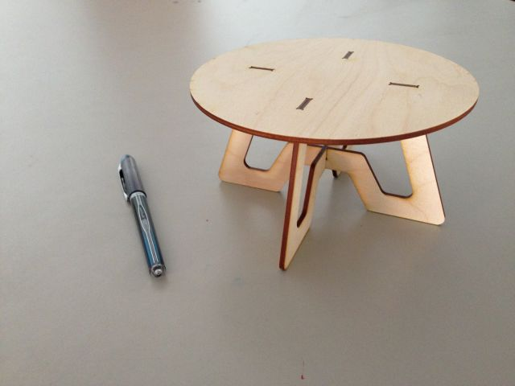

## Test Machining Cut

Next step was to do a test cut on the router. For this I created a small design using bits of the main design in order to test
the tolerances for the notches and joints.

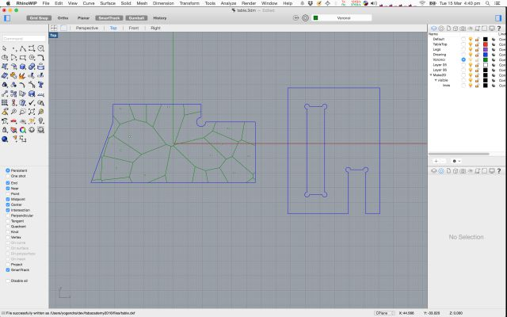

The green pattern above is a Voronoi tessalation generated using Grasshopper 
(from the [Grasshopper Primer](http://www.grasshopper3d.com/profiles/blogs/third-edition-of-the-grasshopper-primer-foundations-released)), 
which I wanted to engrave on the table top:

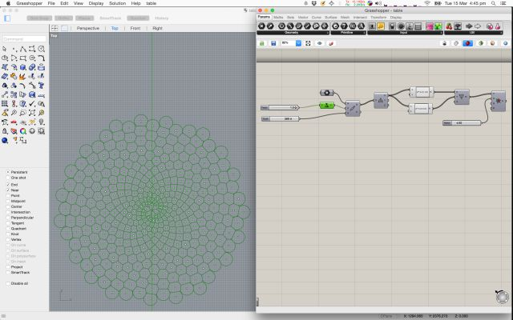

Test cut in progress:

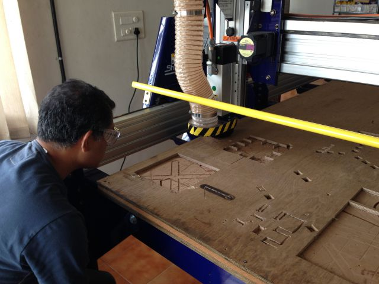

Here are the cut test pieces:

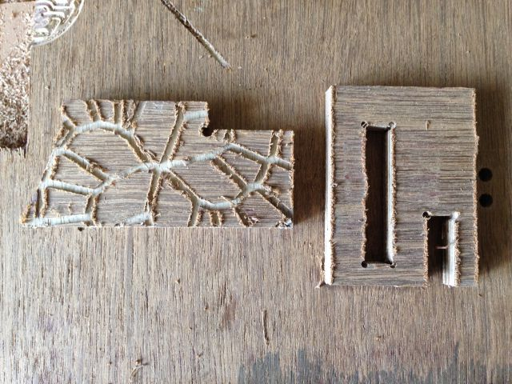

The cut finish wasn't very good. I think this was because I did not screw down the board, and it was moving around during cutting.

Also the engraving doesn't look good, I'll experiment with the V-bit. 

The pieces did not fit correctly, the female portion was smaller than required. In the VCarve Pro settings, I had given a 
0.1mm allowance offset for the interior toolpath but that didn't seem to have the right effect. 
 
I realized that it requires a negative offset, I tried one more cut with a -0.2 offset, which provided a much better fit. 

## Final Print

In VCarve Pro: 

* First, I did a print to drill holes to put in screws. 
* Then I did a combined second print for the entire table - with separate toolpaths for interior cuts and exterior cuts.
* I used 0.25mm allowance offset for interior cuts.
* I used tabs 10mm x 5mm.
* The cut depth was set at 12.2mm, given the stock was 12mm thick.

Here's the final print in progress: 

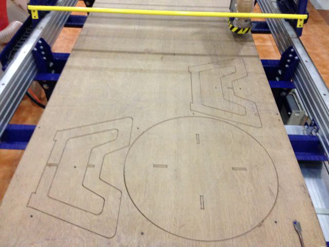

After the print was over I had to remove the stock to saw out the tabs. Here is the assembly in progress:

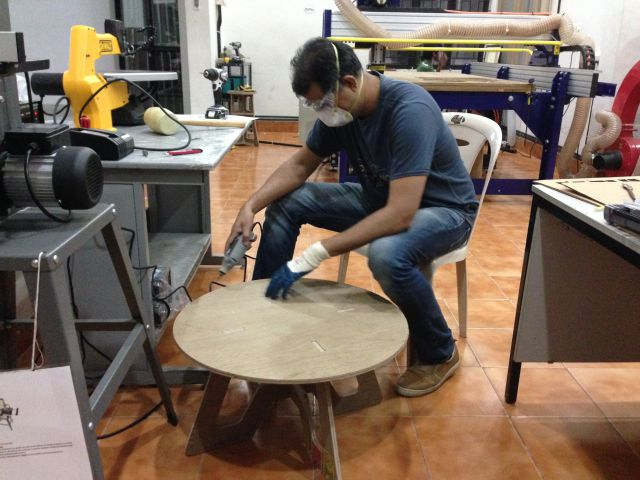

I used a dremel to smoothen the edges and flatten the tabs. Here is the assembled table:

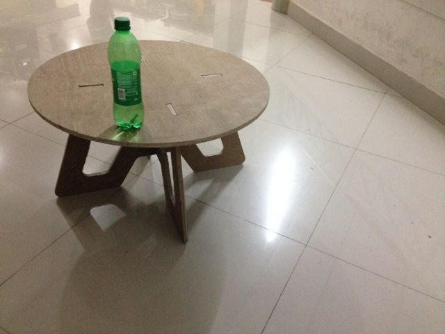

## Learnings:

* Use enough screws to hold the stock down in place. Do a separate print first to drill the holes. Make sure the holes are 
    away from the cutting toolpath - the bit could get damaged if it hit the screw head. 
* Use a sufficient cut-depth - at least 0.5 mm more than the stock depth.
* Allowance offset is very useful. It lets you retain original dimensions in your drawing and use allowance offset to adjust 
    cutting width. Note: It can be positive or negative. For interior cuts it should be negative if you want the interior to be larger.
    You can experiment with large positive and negative numbers and confirm how the toolpath is changing in the toolpath preview, before
    adjusting the offset back to the width you need.
* Use tabs.

## Original Files:

* [w7-table.zip](files/w7-table.zip), contains:
    * Rhino model: table.3dm
    * Grasshopper file: table.gh
    * DXF file for test cut printing: table-test.dxf
    * DXF file for final printing: table.dxf

