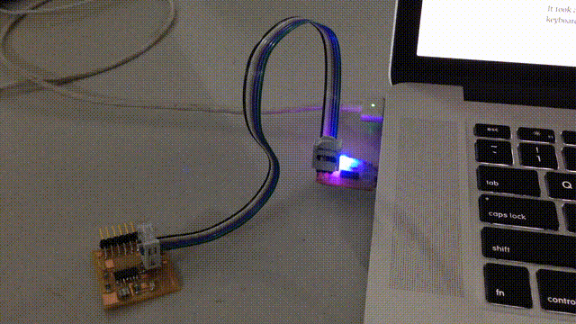
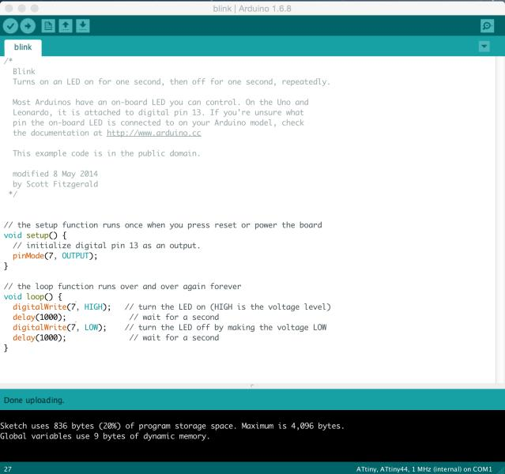
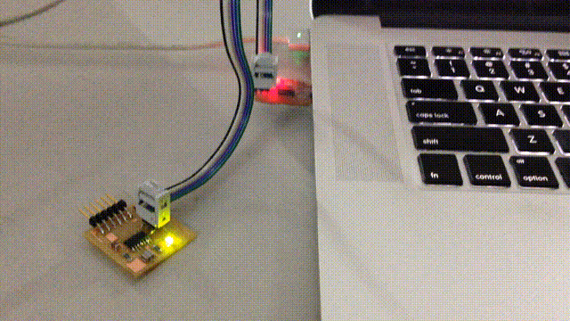
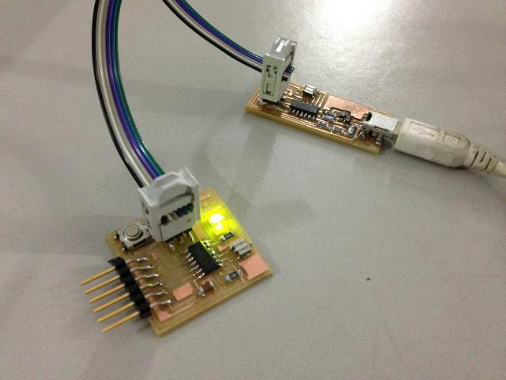

## [Assignment](http://academy.cba.mit.edu/classes/embedded_programming/index.html)

>* read a microcontroller data sheet   
>* program your board to do something, with as many different programming languages and programming environments as possible   

&nbsp;

### Index

- [Program the board](#program-the-board)
    - [Arduino Blink Sketch](#arduino-blink-sketch)
        - [Original Files](#original-files)
    - [Arduino Button Sketch](#arduino-button-sketch)
        - [Original Files](#original-files-1)
    - [C Blink Program](#c-blink-program)
        - [Original Files](#original-files-2)
    - [Assembly Blink Program](#assembly-blink-program)
        - [Original Files](#original-files-3)
    - [Program Size Comparisons](#program-size-comparisons)
    - [Interrupt-based Program](#interrupt-based-program)
        - [Original Files](#original-files-4)
    - [Timer Blink](#timer-blink)
        - [Original Files](#original-files-5)
    - [Software UART Implementation](#software-uart-implementation)
        - [Original Files](#original-files-6)
- [ATtiny44 Datasheet Review](#attiny44-datasheet-review)
    

&nbsp;

---

&nbsp;


## Program the board

### Arduino Blink Sketch

First step was to check if the hello board from week 6 was working fine. 

I used a colleague's FabISP for this, since it was tried and tested.

I downloaded [Arduino IDE](https://www.arduino.cc/en/Main/Software), and followed the instructions 
[here](http://highlowtech.org/?p=1695) to setup [David Mellis']((https://github.com/damellis/attiny)) 
[Board Manager for the ATtiny](https://raw.githubusercontent.com/damellis/attiny/ide-1.6.x-boards-manager/package_damellis_attiny_index.json).
 
I had connected the LED to PA7 which was on pin 6. I opened up the Examples -> Blink sketch and changed the pin number for the LED from 13 to 6. 
 
For reference, here are the schematics and layout for the board from week 6 to figure out which pin the LED is connected to:
   

 


 When I uploaded the sketch, the LED on the FabISP started blinking instead of the one on the hello board, so clearly the LED wasn't on pin 6 but on pin 7:
  


I then changed the pin number to 7 to match "PA7":
 


And it worked just fine. 

Note the size of the binary in the above image shows 836 bytes. Will compare that to a C and assembly program later. 



Next I tested it with my FabISP, and that worked fine too! :-)



Here it is:


#### Original Files

* blink sketch: [blink.ino](files/w8/blink-sketch/blink.ino)


&nbsp;

---

&nbsp;

### Arduino Button Sketch

Next I tried the Button sketch. After programming, it was behaving unusually. The LED would turn on and off if I brought my finger close to 
  the LED. 
  
Francisco mentioned that this was because I hadn't enabled the pull-up resistor and the wire was "floating". 

[Arduino docs](https://www.arduino.cc/en/Tutorial/DigitalPins) mention that pinMode should be set to INPUT_PULLUP instead of 
    INPUT to enable the internal pull-up resistor. After changing this it worked correctly - with the LED being on by default
    because the signal was pulled-up to logical 1 and the code (below) uses this to switch on the LED. 
    
Here is the button sketch with my minor changes:
<pre>
<code class="language-clike">

const int buttonPin = 3;
const int ledPin =  7;

// variables will change:
int buttonState = 0;  

void setup() {
  // initialize the LED pin as an output:
  pinMode(ledPin, OUTPUT);
  // initialize the pushbutton pin as an input:
  pinMode(buttonPin, INPUT_PULLUP); // <----- changed from INPUT
}

void loop() {
  // read the state of the pushbutton value:
  buttonState = digitalRead(buttonPin);

  // check if the pushbutton is pressed.
  // if it is, the buttonState is HIGH:
  if (buttonState == HIGH) {
    // turn LED on:
    digitalWrite(ledPin, HIGH);
  } else {
    // turn LED off:
    digitalWrite(ledPin, LOW);
  }
}
</code>
</pre>

#### Original Files

* button sketch: [button.ino](files/w8/button-sketch/button.ino)


&nbsp;

---

&nbsp;

### C Blink Program

Next step is to write the LED blink program in C. 

I have started reading [Make: AVR Programming](http://www.amazon.com/AVR-Programming-Learning-Software-Hardware/dp/1449355781) by
   Elliot Williams, and I really like this book compared to the couple of others on AVR programming I've tried to read. 
    
I used the Makefile generated from avr-project, which is a Crosspack AVR tool available on the Mac. 
 
Next I tried the following code to blink the LED in C.
 
<pre>
<code class="language-clike">
#include <avr/io.h>
#include <util/delay.h>

#define LED_PIN PA7
const int delay = 1000;

int main(void) {
    DDRA |= (1 << LED_PIN); // sets the data direction of pin 7 in port A to output
    
    while(1) {
        PORTA |= (1 << LED_PIN);  // writes a high value to pin 7
        _delay_ms(delay);
        
        PORTA &= ~(1 << LED_PIN); // write a low value to pin 7
        _delay_ms(delay);
    }

    return 0;
}
</code>
</pre>
 
The output was: 
 
<pre>
$ make flash
avr-gcc -Wall -Os -DF_CPU=20000000 -mmcu=attiny44 -c blink.c -o blink.o
avr-gcc -Wall -Os -DF_CPU=20000000 -mmcu=attiny44 -o blink.elf blink.o
rm -f blink.hex
avr-objcopy -j .text -j .data -O ihex blink.elf blink.hex
avr-size --format=avr --mcu=attiny44 blink.elf
AVR Memory Usage
----------------
Device: attiny44

Program:     100 bytes (2.4% Full)
(.text + .data + .bootloader)

Data:          0 bytes (0.0% Full)
(.data + .bss + .noinit)


avrdude -c usbtiny  -p attiny44 -U flash:w:blink.hex:i

avrdude: AVR device initialized and ready to accept instructions

Reading | ################################################## | 100% 0.00s

avrdude: Device signature = 0x1e9207
avrdude: NOTE: "flash" memory has been specified, an erase cycle will be performed
         To disable this feature, specify the -D option.
avrdude: erasing chip
avrdude: reading input file "blink.hex"
avrdude: writing flash (100 bytes):

Writing | ################################################## | 100% 0.13s

avrdude: 100 bytes of flash written
avrdude: verifying flash memory against blink.hex:
avrdude: load data flash data from input file blink.hex:
avrdude: input file blink.hex contains 100 bytes
avrdude: reading on-chip flash data:

Reading | ################################################## | 100% 0.15s

avrdude: verifying ...
avrdude: 100 bytes of flash verified

avrdude: safemode: Fuses OK (H:FF, E:DF, L:62)

avrdude done.  Thank you.
</pre>

It shows that the program size is 100 bytes, which is much smaller than the one generated through the Arduino Sketch (836 bytes).
  
The LED did start blinking, but it isn't blinking as fast as it should - the delay seems more like 2 sec than 100ms. 

The makefile had a variable defined called CLOCK, which was set to 20000000. I changed it to 1000000 (got this hint from 
    the Arduino status bar which reported "ATtiny44, 1Mhz internal"). With this change it started working correctly.
    
The datasheet says this in Section 6.2.6 (page 30) about the "Default Clock Source":

> The default clock source setting is therefore the Internal Oscillator running at 8.0 MHz with longest start-up time 
> and an initial system clock prescaling of 8, resulting in 1.0 MHz system clock. 


#### Original Files

* blink c program: [blink.c](files/w8/blink-c/blink.c) 
* Makefile: [Makefile](files/w8/blink-c/Makefile) 


&nbsp;

---

&nbsp;

### Assembly Blink program

Next step is to program in assembly language.  

I'm going through tutorials on [AVR Beginners](http://www.avrbeginners.net/) for this.

#### Toolchain setup

I've installed [avra](http://sourceforge.net/projects/avra/) assembler using homebrew, since [gavrasm](http://www.avr-asm-tutorial.net/gavrasm/index_en.html) 
    is available only for Windows and Linux.

I used Francisco's [code](http://beachlab.org/fab2016/assembly.html) to check if avra was working as expected. 

I had to add the following line to include the declarations file for the attiny44 from [here](https://github.com/DarkSector/AVR/blob/master/asm/include/tn44def.inc).

```
.include tn44def.inc
```

I ran: 

```
avra blink.asm
```

and it output:

<pre>
$ make flash
avrdude -c usbtiny -p attiny44 -U flash:w:blink.hex:i

avrdude: AVR device initialized and ready to accept instructions

Reading | ################################################## | 100% 0.00s

avrdude: Device signature = 0x1e9207
avrdude: NOTE: "flash" memory has been specified, an erase cycle will be performed
         To disable this feature, specify the -D option.
avrdude: erasing chip
avrdude: reading input file "blink.hex"
avrdude: writing flash (8 bytes):

Writing | ################################################## | 100% 0.05s

avrdude: 8 bytes of flash written
avrdude: verifying flash memory against blink.hex:
avrdude: load data flash data from input file blink.hex:
avrdude: input file blink.hex contains 8 bytes
avrdude: reading on-chip flash data:

Reading | ################################################## | 100% 0.07s

avrdude: verifying ...
avrdude: 8 bytes of flash verified

avrdude: safemode: Fuses OK (H:FF, E:DF, L:62)

avrdude done.  Thank you.

</pre>

This worked, but the LED appeared to be on continuously since there was no delay in the code.

Next step is to add in some delay. This could be done by using interrupts or by keeping the processor busy for the expected time-period. 

The following code uses 2 registers as a single 16 bit value and increments it till there is an overflow. This introduces 
 a small delay which makes the LED blinking visible. 

<pre>
clr r24                 ; clear register to use as part of word
clr r25                 ; clear register to use as part of word
delay_loop1:        
adiw r24, 1             ; add 1 to the word starting at r24
brne delay_loop1        ; loop until overflow
</pre>

The total time taken is calculated as follows (refer to the [AVR Instruction Set Manual](www.atmel.com/images/atmel-0856-avr-instruction-set-manual.pdf)
 for the clock-cycles for a specific instruction. The ATtiny datasheet also provides this information at the end:

* clr: 1 cycle
* adiw: 2 cycles
* brne: 2 cycles when no overflow, 1 on overflow

<pre>
Delay cycles =    
    2 * clr(1 cycle)    
    + 65536 * looping(4 cycles)      
    + 1 * overflow(3 cycles)    
    = 2 + 262144 + 3   
    = 262149
</pre>


Given that the clock is running prescaled at 1mhz == 1µs per clock cycle, the delay is 262149µs or ~ 262ms.

Here is the full code with delays:

<pre>
; blink.asm
;
; Blink LED 

.include "tn44def.inc"

.org 0              ; sets the programs origin

sbi DDRA, 7         ; set bit in Data Direction Register to mark the pin as output

loop:       
sbi PORTA, 7        ; turn on the LED

clr r24             ; clear register to use as part of word             
clr r25             ; clear register to use as part of word             
delay_loop1:                                                            
adiw r24, 1         ; add 1 to the word starting at r24                 
brne delay_loop1    ; loop until overflow                               

cbi PORTA, 7        ; turn off the LED

clr r24             ; clear register to use as part of word
clr r25             ; clear register to use as part of word
delay_loop2:                                               
adiw r24, 1         ; add 1 to the word starting at r24    
brne delay_loop2    ; loop until overflow                  

rjmp loop

</pre>

#### Original Files

* Blink asm program: [blink.asm](files/w8/blink-asm/blink.asm) 
* Makefile: [Makefile](files/w8/blink-asm/Makefile) 
* Directives file: [tn44def.inc](files/w8/blink-asm/tn44def.inc) 


&nbsp;

---

&nbsp;

### Program Size Comparisons

The output of avrdude shows the program size for the blink LED programs: 

* Arduino sketch: 836 bytes

* C program: 100 bytes

* Assembly program: 8 bytes

<pre>
$ avr-objdump -j .sec1 -d -m avr blink.hex 

blink.hex:     file format ihex


Disassembly of section .sec1:

00000000 <.sec1>:
   0:	d7 9a       	sbi	0x1a, 7	; 26
   2:	df 9a       	sbi	0x1b, 7	; 27
   4:	88 27       	eor	r24, r24
   6:	99 27       	eor	r25, r25
   8:	01 96       	adiw	r24, 0x01	; 1
   a:	f1 f7       	brne	.-4      	;  0x8
   c:	df 98       	cbi	0x1b, 7	; 27
   e:	88 27       	eor	r24, r24
  10:	99 27       	eor	r25, r25
  12:	01 96       	adiw	r24, 0x01	; 1
  14:	f1 f7       	brne	.-4      	;  0x12
  16:	f5 cf       	rjmp	.-22     	;  0x2

</pre>

It was interesting that the clr instruction was replaced by an eor (Exclusive OR) of the register with itself.

The size seems more than 8 bytes. Also avr-size shows the size as 24 bytes... not sure why avrdude mentions "8 bytes of flash verified".

<pre>
$ avr-size blink.hex 
   text	   data	    bss	    dec	    hex	filename
      0	     24	      0	     24	     18	blink.hex
</pre>


&nbsp;

---

&nbsp;


### Interrupt-based program

Here is a program, which continuously blinks the LED every 100ms. On pressing the button (and holding it down), the LED is turned
 off for 1 sec before resuming blinking. On releasing the button, the LED is turned on for 1 sec before resuming blinking.
 
This is implemented using interrupts, see the commented code below.
 
Notes:

* The INT0 interrupt allows triggering changes on pin low, pin change, pin high edge, pin low edge. 
    * INT0 on the attiny44 is available on pin PB2.
* It supports 2 pin change interrupts PCINT0 and PCINT1. 
    * PCINT0 handles pin changes on pins 0:7, PCINT1 handles pins 8:11
    * Bits in PCMSK0 and PCMSK1 need to be set to indicate which specific pin the program is interested in.

<pre>
<code class="language-clike">

#include <avr/io.h>
#include <avr/interrupt.h>
#include <util/delay.h>

#define LED_DDR     DDRA
#define LED         PA7
#define LED_PORT    PORTA

#define BUTTON_PORT PORTA
#define BUTTON      PA3
#define BUTTON_PIN  PINA

const int delay = 100;

ISR(PCINT0_vect) {
    // by default the bit will have a high value because of the pull-up resistor
    if(bit_is_set(BUTTON_PIN, BUTTON)) {    // this is true when a pressed button is released
        LED_PORT |= (1 << LED);             // turn LED on
        _delay_ms(1000);                    // so we can see the change
    } else {                                // this will happen when the button is pressed
        LED_PORT &= ~(1 << LED);            // turn LED off
        _delay_ms(1000);
    }    
}

void initPinChangeInterrupt(void) {
    GIMSK |= (1 << PCIE0);              // enable pin change interrupt 0
    PCMSK0 |= (1 << BUTTON);            // ... only for the button
    sei();                              // enable interrupts globally
}

int main(void) {
    LED_DDR |= (1 << LED);              // mark LED as output 
    BUTTON_PORT |= (1 << BUTTON);       // mark button as input and enable pull-up resistor
    
    initPinChangeInterrupt();

    while(1) {
        _delay_ms(delay);
        LED_PORT ^= (1 << LED);         // toggle the LED
    }
    return 0;
}
</code>
</pre>


#### Original Files

* C source: [button-int.c](files/w8/button-interrupts-c/button-int.c) 
* Makefile: [Makefile](files/w8/button-interrupts-c//Makefile) 

&nbsp;

---

&nbsp;


## Timer Blink

This program implements the blink logic as a timer event rather than a delay loop. Here is the commented code: 

<pre>
<code class="language-clike">
#include <avr/io.h>
#include <avr/interrupt.h>
#include <util/delay.h>

#define LED_DDR     DDRA
#define LED         PA7
#define LED_PORT    PORTA

ISR(TIM0_OVF_vect) {
  // interrupt occurs every:
  //    1000000 / 1024 * 256 
  //    = ~ 250000 clocks 
  //    = ~250 ms (since clock is 1mhz and 1 clock cycle = 1µs)
  // Note: 1024 is the clock prescaler
  //        256 is the overflow limit for the 8 bit counter
  
  LED_PORT ^= (1 << LED);   //toggle led pin 
} 
 
void initTimerInterrupt(void) {
  TCCR0B |= (1<<CS02) | (1<<CS00);          //clock select: prescale timer clk/1024
  TIMSK0 |= (1<<TOIE0);                     //enable timer overflow interrupt      
  sei();                                    // globally enable interrupts
}

void main(void) {
    LED_DDR |= (1 << LED);              // mark LED as output 
    initTimerInterrupt();
    while(1);                           // loop forever
}

</code>
</pre>

#### Original Files

* C source: [main.c](files/w8/timer/main.c) 
* Makefile: [Makefile](files/w8/timer/Makefile) 


&nbsp;

---

&nbsp;


## Software UART Implementation

For debugging puproses it would be useful to output some data through the serial interface and display it on a host terminal.
 
However, the ATtiny44 does not have a UART implementation in hardware, instead it supports SPI. 
 
The goal of this mini-project is to implement a software UART interface that allows debugging output to be written out.
 
Here is a first attempt:

<pre>
<code class="language-clike">
#include <avr/io.h>
#include <avr/interrupt.h>
#include <util/delay.h>

#define CLOCK 1e6
#define BAUD 9600

#define STX_PORT PORTA
#define STX_PIN  0

#define LED_PIN PA7

#define BUTTON_PORT PORTA
#define BUTTON      PA3
#define BUTTON_PIN  PINA

#define MICROSECONDS_PER_BIT (CLOCK / BAUD) 

static uint8_t start_sending = 0;


ISR(PCINT0_vect) {
    blinkLED();
    start_sending = 1;
}


void initPinChangeInterrupt(void) {
    GIMSK |= (1 << PCIE0);              // enable pin change interrupt 0
    PCMSK0 |= (1 << BUTTON);            // enable pin change only for button
}


void sendByte(uint8_t c) {
    STX_PORT &= ~(1<<STX_PIN);            // start bit
    _delay_us(MICROSECONDS_PER_BIT);              // bit duration
    
    uint8_t mask;
    
    for(mask = 0x01; mask; mask <<= 1) {        // data bits
        if( c & mask ) {
            STX_PORT |= 1<<STX_PIN;           // data bit 1 
        } else {
            STX_PORT &= ~(1<<STX_PIN);        // data bit 0
        }
        _delay_us(MICROSECONDS_PER_BIT);
    }
    
    STX_PORT |= 1<<STX_PIN;           // stop bit 
    _delay_us(MICROSECONDS_PER_BIT);
}


void blinkLED() {
    PORTA |= (1 << LED_PIN);  // writes a high value to pin 7
    _delay_ms(100);
    PORTA &= ~(1 << LED_PIN); // write a low value to pin 7
    _delay_ms(100);
}

int main(void) {
    DDRA |= (1 << LED_PIN);
    BUTTON_PORT |= (1 << BUTTON);       // mark button as input and enable pull-up resistor
    
    initPinChangeInterrupt();
    sei();                              // globally enable interrupts

    uint8_t i = 0;      

    for(;;){
        if(start_sending) {
            sendByte(65);  // Send byte of data
            i++;                // Add one to the counter
            
            if(i == 10){        // End of Data
                i = 0;              // Reset Counter
                _delay_ms(500);      // Delay a bit before sending another block of data
                blinkLED();
            }
        }
    }
    
    return 0;
}
</code>
</pre>

I used screen and pyserial to connect from my laptop via an FTDI board to the hello board, but it was not able to output 
the data that was being written.
 
I did test that the setup was working fine by connecting the RX & TX pins on the FTDI board, and it was successfully echoing
 whatever I typed into the terminal.
 
Need to debug this further.

#### Original Files

* C source: [main.c](files/w8/uart/main.c) 
* Makefile: [Makefile](files/w8/uart/Makefile) 


&nbsp;

---

&nbsp;


## ATtiny44 Datasheet Review

This [datasheet](http://www.atmel.com/images/doc8006.pdf) covers ATtiny24 / 44 / 84. We're using the ATtiny44. 

* Key features
    * RISC - mostly single clock cycle execution instructions
    * Speed - upto 20mhz at 4.5 - 5.5 V (upto 10mhz at 2.7 - 4.5 V)
    * Low power mode
    * 32 8bit registers
    * 4K ISP flash
    * 256b SRAM

* Memory
    * Separate data and program memory, also EEPROM for data
    * 4k program memory for tiny44 - 2k x 16b locations (1 instructions takes 16 / 32b)
    * SRAM
        first 32b for register file
        next 64b for IO registers
        next 256b for data
        access time is 2 clock cycles: 1 to compute address, 1 to access 
    * EEPROM
        256b
    * Fuse bytes
        * 3b of non-volatile memory 
        * bits to control important settings like clock source, debugWire enable, etc

* Status Register
    * updated after every instruction
    * bit 7 - Global Interrupt Enable bit
    * is cleared by hardware when an interrupt occurs, is set by RETI instruction to enable subsequent interrupts
        
* Register File
    * 32 general purpose registers
    * Also have an address as the first 32 locations of user data space
    
* Stack pointer
    * separate stacks for subroutines and interrupts
    
* Instruction execution timing
    * Within 1 clock cycle: fetch 2 register operands, execute ALU operation, store result into register
      
* Reset & Interrupt handling      
    * interrupt vector stored in program space
    * interrupts have priorities - RESET has highest, next is INT0 - External Interrupt Request 0
    * takes 4 clock cycles to start executing interrupt routine code, and 4 to return from it

* Clock 
    * multiple clock sources possible
        * external
        * internal 8mhz
            * default source with prescaling to 1mhz
        * internal 128khz
        * internal 32khz
    * multiplexer selects one based on fuse set
    * this is passed through a prescaler, which divides the clock source to reduce power consumption
    * this "system" clock feeds into AVR Clock Control Unit, which provides different clock domains - CPU, IO, ADC, Flash
    * system clock output can be sent to the CKOUT pin by setting a fuse
    * clock timing checks and calibration?
      
* Power Management and Sleep Modes
    * 4 sleep modes: idle, ADC noise reduction, power-down, stand by
    
* Brown Out Detection disable?

* Reset
    * 4 sources: 
        * Power On Reset: 
        * External reset: low value on the RESET pin
        * BOD reset: triggered when voltage drops below a threshold
        * Watchdog timer: triggered when timer fires
    
* Watchdog Timer
    * generates a reset pulse when a given delay is exceeded, and a WDR (Watchdog Reset) instruction has not been executed
    
* IO
    * pins can be marked as input or output using DDRxn bit, input is 0, output is 1
    * pull-up resistor can be enabled on input pins by setting PORTxn to 1
    
* 8bit / 16bit Timer/Counter with PWM
    * can be used to time program execution, waveform generation

* Universal Serial Interface?

* Analog Comparator
    * Can monitor voltages on AIN0 (postive) and AIN1(negative) and trigger an interrupt or output a value when the 
        positive voltage is higher than the negative one
    
* ADC?

* DebugWire
    * bi-directional interface to control program flow, execute instructions and program non-volatile memories
    * uses RESET port pin 

* Self Programming Mechanism for Flash
    * allows MCU to download and upload code using any data interface and write to program flash memory
    
* Bootloader?  


&nbsp;

---

&nbsp;

### Notes

* Clock signal: edge-triggered, value can be read or written only at clock-edge (rising or falling)
    clocked flip-flop, latch

* Multiplexer: data selector, selects 1 signal from many and forwards to its output n selector lines can have 2^n input signals

* Datapath: 
    2 types of elements: combinational (ALU), state aka "sequential" logic components (memory, registers) 
    1 clock signal involves reading from a state element, maybe register, passing it through combinational logic and saving to a state element

* Registers
    1 flip-flop per bit, clock signal, control signal
    on clock signal, check control and load in parallel from input or hold value


&nbsp;

---

&nbsp;

### Questions

* "Fully static operation"?
